# 실시간 주식 트레이딩 시스템 설계 문서

## 개요
본 문서는 한국투자증권 API를 활용한 실시간 데이터 수집부터 DQN 강화학습 알고리즘을 통한 실시간 거래까지의 전체 시스템 설계를 담고 있습니다.

### 기술 스택
- Python 3.10
- PyTorch 2.1.1+cu118
- 한국투자증권 Open API
- 로깅 시스템 (Python logging 모듈)
- 데이터베이스 (PostgreSQL)
- 모니터링 시스템 (Grafana/Prometheus)

### 시스템 요구사항
1. 철저한 로깅 구현
2. 한글 처리 지원
3. 기능 단위별 데이터 입출력 명세
4. 인터페이스 기반 설계로 모델 업데이트 편의성 확보
5. 모든 날짜/시간 데이터는 시스템 현재 시간 기준 처리

## 1. 전체 시스템 플로우차트

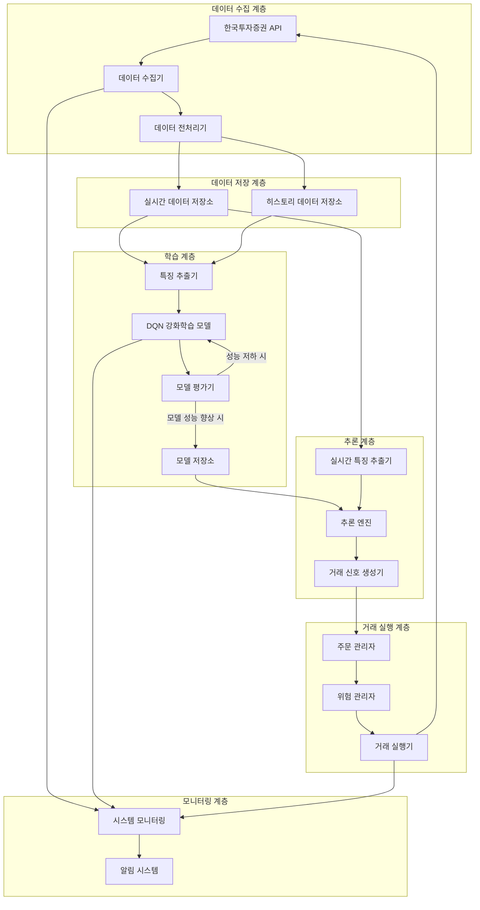
```mermaid
flowchart TD
    subgraph "데이터 수집 계층"
        A[한국투자증권 API] --> B[데이터 수집기]
        B --> C[데이터 전처리기]
    end
    
    subgraph "데이터 저장 계층"
        C --> D[실시간 데이터 저장소]
        C --> E[히스토리 데이터 저장소]
    end
    
    subgraph "학습 계층"
        D --> F[특징 추출기]
        E --> F
        F --> G[DQN 강화학습 모델]
        G --> H[모델 평가기]
        H --> |모델 성능 향상 시|I[모델 저장소]
        H --> |성능 저하 시|G
    end
    
    subgraph "추론 계층"
        D --> J[실시간 특징 추출기]
        I --> K[추론 엔진]
        J --> K
        K --> L[거래 신호 생성기]
    end
    
    subgraph "거래 실행 계층"
        L --> M[주문 관리자]
        M --> N[위험 관리자]
        N --> O[거래 실행기]
        O --> A
    end
    
    subgraph "모니터링 계층"
        B --> P[시스템 모니터링]
        G --> P
        O --> P
        P --> Q[알림 시스템]
    end
```

### 전체 시스템 설명

실시간 주식 트레이딩 시스템은 크게 6개의 계층으로 구성되어 있습니다:

1. **데이터 수집 계층**: 한국투자증권 API로부터 실시간 주식 데이터를 수집하고 전처리합니다.
2. **데이터 저장 계층**: 실시간 데이터와 히스토리 데이터를 저장합니다.
3. **학습 계층**: 저장된 데이터로부터 특징을 추출하고 DQN 강화학습 모델을 학습시킵니다.
4. **추론 계층**: 학습된 모델을 사용하여 실시간 데이터에 대한 추론을 수행합니다.
5. **거래 실행 계층**: 추론 결과에 따라 실제 거래를 실행합니다.
6. **모니터링 계층**: 전체 시스템을 모니터링하고 필요시 알림을 발생시킵니다.

## 2. 전체 시스템 시퀀스 다이어그램

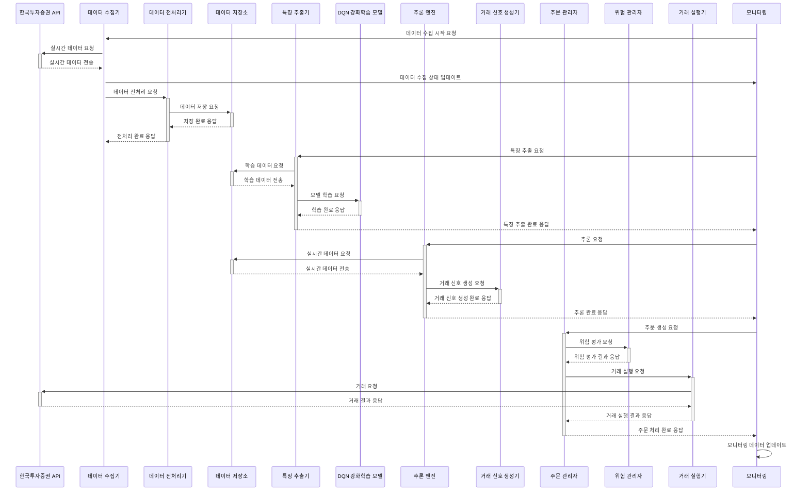
```mermaid
sequenceDiagram
    participant API as 한국투자증권 API
    participant DC as 데이터 수집기
    participant DP as 데이터 전처리기
    participant DS as 데이터 저장소
    participant FE as 특징 추출기
    participant ML as DQN 강화학습 모델
    participant IE as 추론 엔진
    participant TS as 거래 신호 생성기
    participant OM as 주문 관리자
    participant RM as 위험 관리자
    participant TE as 거래 실행기
    participant MO as 모니터링

    MO->>+DC: 데이터 수집 시작 요청
    DC->>+API: 실시간 데이터 요청
    API-->>-DC: 실시간 데이터 전송
    DC->>MO: 데이터 수집 상태 업데이트
    DC->>+DP: 데이터 전처리 요청
    DP->>+DS: 데이터 저장 요청
    DS-->>-DP: 저장 완료 응답
    DP-->>-DC: 전처리 완료 응답
    
    MO->>+FE: 특징 추출 요청
    FE->>+DS: 학습 데이터 요청
    DS-->>-FE: 학습 데이터 전송
    FE->>+ML: 모델 학습 요청
    ML-->>-FE: 학습 완료 응답
    FE-->>-MO: 특징 추출 완료 응답
    
    MO->>+IE: 추론 요청
    IE->>+DS: 실시간 데이터 요청
    DS-->>-IE: 실시간 데이터 전송
    IE->>+TS: 거래 신호 생성 요청
    TS-->>-IE: 거래 신호 생성 완료 응답
    IE-->>-MO: 추론 완료 응답
    
    MO->>+OM: 주문 생성 요청
    OM->>+RM: 위험 평가 요청
    RM-->>-OM: 위험 평가 결과 응답
    OM->>+TE: 거래 실행 요청
    TE->>+API: 거래 요청
    API-->>-TE: 거래 결과 응답
    TE-->>-OM: 거래 실행 결과 응답
    OM-->>-MO: 주문 처리 완료 응답
    
    MO->>MO: 모니터링 데이터 업데이트
```

### 전체 시퀀스 설명

위 시퀀스 다이어그램은 시스템의 주요 구성 요소 간의 상호작용과 데이터 흐름을 보여줍니다:

1. 모니터링 시스템이 데이터 수집을 시작하면, 데이터 수집기는 한국투자증권 API에 실시간 데이터를 요청합니다.
2. 수집된 데이터는 전처리 과정을 거쳐 데이터 저장소에 저장됩니다.
3. 특징 추출기는 저장된 데이터로부터 학습에 필요한 특징을 추출하고, DQN 모델을 학습시킵니다.
4. 추론 엔진은 실시간 데이터를 기반으로 거래 신호를 생성합니다.
5. 주문 관리자는 거래 신호에 따라 주문을 생성하고, 위험 관리를 거쳐 거래를 실행합니다.
6. 전체 과정은 모니터링 시스템에 의해 실시간으로 감시됩니다.

## 3. 전체 시스템 클래스 다이어그램

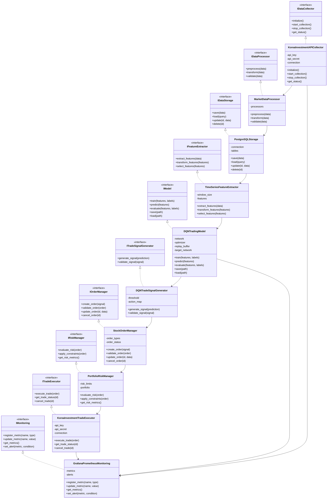
```mermaid
classDiagram
    class IDataCollector {
        <<interface>>
        +initialize()
        +start_collection()
        +stop_collection()
        +get_status()
    }
    
    class IDataProcessor {
        <<interface>>
        +preprocess(data)
        +transform(data)
        +validate(data)
    }
    
    class IDataStorage {
        <<interface>>
        +save(data)
        +load(query)
        +update(id, data)
        +delete(id)
    }
    
    class IFeatureExtractor {
        <<interface>>
        +extract_features(data)
        +transform_features(features)
        +select_features(features)
    }
    
    class IModel {
        <<interface>>
        +train(features, labels)
        +predict(features)
        +evaluate(features, labels)
        +save(path)
        +load(path)
    }
    
    class ITradeSignalGenerator {
        <<interface>>
        +generate_signal(prediction)
        +validate_signal(signal)
    }
    
    class IOrderManager {
        <<interface>>
        +create_order(signal)
        +validate_order(order)
        +update_order(id, data)
        +cancel_order(id)
    }
    
    class IRiskManager {
        <<interface>>
        +evaluate_risk(order)
        +apply_constraints(order)
        +get_risk_metrics()
    }
    
    class ITradeExecutor {
        <<interface>>
        +execute_trade(order)
        +get_trade_status(id)
        +cancel_trade(id)
    }
    
    class IMonitoring {
        <<interface>>
        +register_metric(name, type)
        +update_metric(name, value)
        +get_metrics()
        +set_alert(metric, condition)
    }
    
    class KoreaInvestmentAPICollector {
        -api_key
        -api_secret
        -connection
        +initialize()
        +start_collection()
        +stop_collection()
        +get_status()
    }
    
    class MarketDataProcessor {
        -processors
        +preprocess(data)
        +transform(data)
        +validate(data)
    }
    
    class PostgreSQLStorage {
        -connection
        -tables
        +save(data)
        +load(query)
        +update(id, data)
        +delete(id)
    }
    
    class TimeSeriesFeatureExtractor {
        -window_size
        -features
        +extract_features(data)
        +transform_features(features)
        +select_features(features)
    }
    
    class DQNTradingModel {
        -network
        -optimizer
        -replay_buffer
        -target_network
        +train(features, labels)
        +predict(features)
        +evaluate(features, labels)
        +save(path)
        +load(path)
    }
    
    class DQNTradeSignalGenerator {
        -threshold
        -action_map
        +generate_signal(prediction)
        +validate_signal(signal)
    }
    
    class StockOrderManager {
        -order_types
        -order_status
        +create_order(signal)
        +validate_order(order)
        +update_order(id, data)
        +cancel_order(id)
    }
    
    class PortfolioRiskManager {
        -risk_limits
        -portfolio
        +evaluate_risk(order)
        +apply_constraints(order)
        +get_risk_metrics()
    }
    
    class KoreaInvestmentTradeExecutor {
        -api_key
        -api_secret
        -connection
        +execute_trade(order)
        +get_trade_status(id)
        +cancel_trade(id)
    }
    
    class GrafanaPrometheusMonitoring {
        -metrics
        -alerts
        +register_metric(name, type)
        +update_metric(name, value)
        +get_metrics()
        +set_alert(metric, condition)
    }
    
    IDataCollector <|.. KoreaInvestmentAPICollector
    IDataProcessor <|.. MarketDataProcessor
    IDataStorage <|.. PostgreSQLStorage
    IFeatureExtractor <|.. TimeSeriesFeatureExtractor
    IModel <|.. DQNTradingModel
    ITradeSignalGenerator <|.. DQNTradeSignalGenerator
    IOrderManager <|.. StockOrderManager
    IRiskManager <|.. PortfolioRiskManager
    ITradeExecutor <|.. KoreaInvestmentTradeExecutor
    IMonitoring <|.. GrafanaPrometheusMonitoring
    
    KoreaInvestmentAPICollector --> MarketDataProcessor
    MarketDataProcessor --> PostgreSQLStorage
    PostgreSQLStorage --> TimeSeriesFeatureExtractor
    TimeSeriesFeatureExtractor --> DQNTradingModel
    DQNTradingModel --> DQNTradeSignalGenerator
    DQNTradeSignalGenerator --> StockOrderManager
    StockOrderManager --> PortfolioRiskManager
    PortfolioRiskManager --> KoreaInvestmentTradeExecutor
    KoreaInvestmentAPICollector --> GrafanaPrometheusMonitoring
    KoreaInvestmentTradeExecutor --> GrafanaPrometheusMonitoring
    DQNTradingModel --> GrafanaPrometheusMonitoring
```

### 전체 클래스 다이어그램 설명

이 클래스 다이어그램은 시스템의 주요 구성 요소들과 그들 간의 관계를 보여줍니다:

1. **인터페이스 계층**: 각 기능 단위는 인터페이스로 정의되어 있어 구현체를 쉽게 교체할 수 있습니다.
2. **구현 클래스**: 각 인터페이스는 하나 이상의 구체적인 클래스로 구현됩니다.
3. **관계**: 클래스 간의 의존성과 통신 흐름을 나타냅니다.

인터페이스 기반 설계를 통해 모델 업데이트나 구성 요소 교체 시 시스템의 다른 부분에 영향을 최소화할 수 있습니다.

## 4. 전체 시스템 컴포넌트 다이어그램

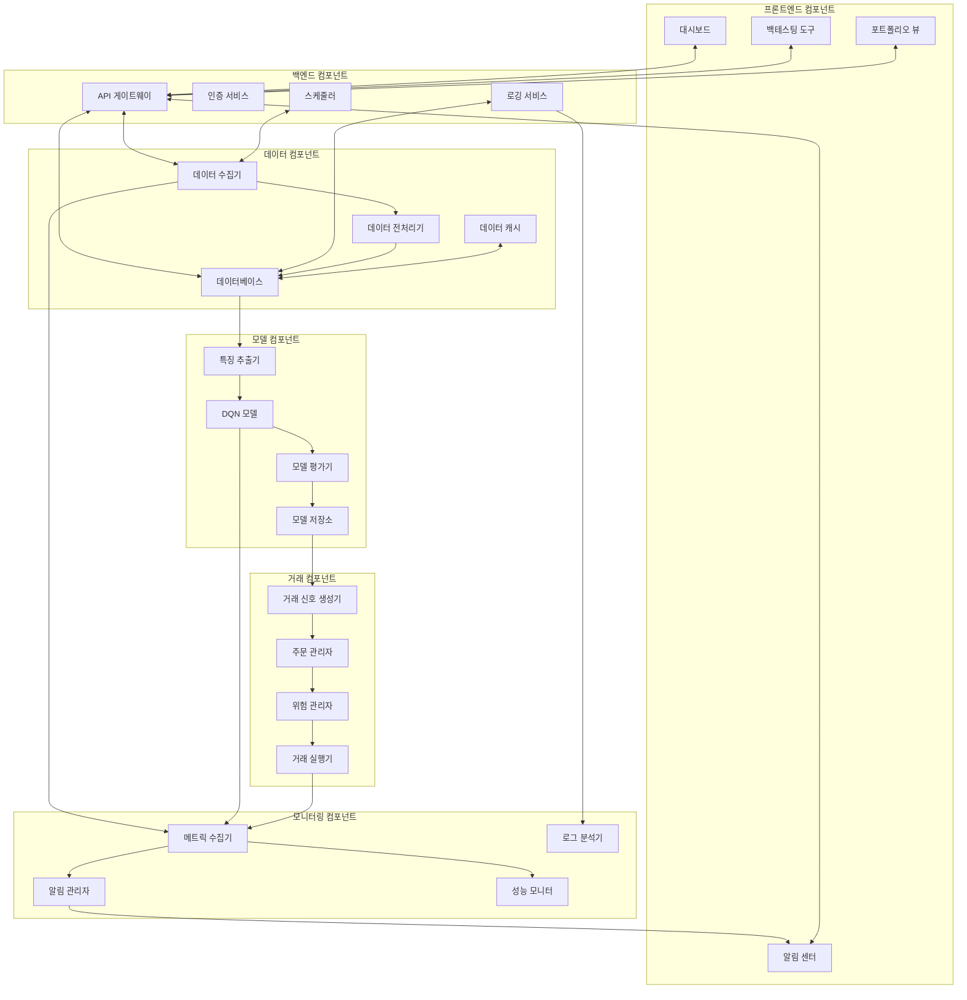
```mermaid
flowchart TB
    subgraph "프론트엔드 컴포넌트"
        FE1[대시보드]
        FE2[알림 센터]
        FE3[백테스팅 도구]
        FE4[포트폴리오 뷰]
    end
    
    subgraph "백엔드 컴포넌트"
        BE1[API 게이트웨이]
        BE2[인증 서비스]
        BE3[로깅 서비스]
        BE4[스케줄러]
    end
    
    subgraph "데이터 컴포넌트"
        D1[데이터 수집기]
        D2[데이터 전처리기]
        D3[데이터베이스]
        D4[데이터 캐시]
    end
    
    subgraph "모델 컴포넌트"
        M1[특징 추출기]
        M2[DQN 모델]
        M3[모델 평가기]
        M4[모델 저장소]
    end
    
    subgraph "거래 컴포넌트"
        T1[거래 신호 생성기]
        T2[주문 관리자]
        T3[위험 관리자]
        T4[거래 실행기]
    end
    
    subgraph "모니터링 컴포넌트"
        MO1[메트릭 수집기]
        MO2[알림 관리자]
        MO3[로그 분석기]
        MO4[성능 모니터]
    end
    
    %% 프론트엔드와 백엔드 연결
    FE1 <--> BE1
    FE2 <--> BE1
    FE3 <--> BE1
    FE4 <--> BE1
    
    %% 백엔드와 데이터 연결
    BE1 <--> D1
    BE1 <--> D3
    BE3 <--> D3
    BE4 <--> D1
    
    %% 데이터와 모델 연결
    D1 --> D2
    D2 --> D3
    D3 --> M1
    D4 <--> D3
    
    %% 모델과 거래 연결
    M1 --> M2
    M2 --> M3
    M3 --> M4
    M4 --> T1
    
    %% 거래 컴포넌트 연결
    T1 --> T2
    T2 --> T3
    T3 --> T4
    
    %% 모니터링 연결
    D1 --> MO1
    M2 --> MO1
    T4 --> MO1
    MO1 --> MO2
    MO2 --> FE2
    BE3 --> MO3
    MO1 --> MO4
```

### 전체 컴포넌트 다이어그램 설명

컴포넌트 다이어그램은 시스템을 구성하는 주요 컴포넌트 그룹과 그들 간의 상호작용을 보여줍니다:

1. **프론트엔드 컴포넌트**: 사용자 인터페이스를 제공하는 컴포넌트들입니다.
2. **백엔드 컴포넌트**: 시스템 운영에 필요한 핵심 서비스를 제공합니다.
3. **데이터 컴포넌트**: 데이터 수집, 처리 및 저장을 담당합니다.
4. **모델 컴포넌트**: DQN 강화학습 모델 관련 기능을 담당합니다.
5. **거래 컴포넌트**: 실제 거래 실행에 관련된 기능을 제공합니다.
6. **모니터링 컴포넌트**: 시스템 모니터링 및 알림을 담당합니다.

각 컴포넌트 그룹 내부의 컴포넌트들은 특정 기능을 수행하며, 그룹 간 통신을 통해 전체 시스템이 동작합니다.

## 5. 기능 단위별 상세 설계

### 5.1 데이터 수집 기능

#### 5.1.1 데이터 수집 플로우차트

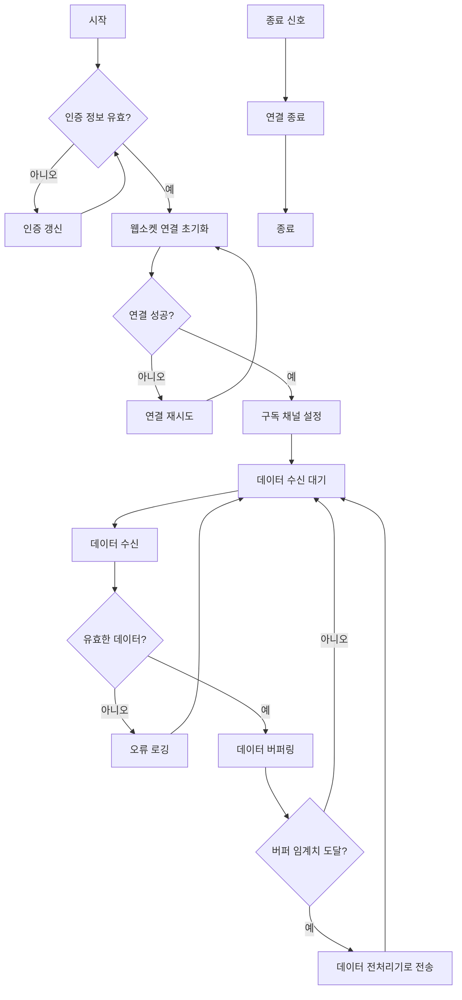
```mermaid
flowchart TD
    A[시작] --> B{인증 정보 유효?}
    B -->|아니오| C[인증 갱신]
    C --> B
    B -->|예| D[웹소켓 연결 초기화]
    D --> E{연결 성공?}
    E -->|아니오| F[연결 재시도]
    F --> D
    E -->|예| G[구독 채널 설정]
    G --> H[데이터 수신 대기]
    H --> I[데이터 수신]
    I --> J{유효한 데이터?}
    J -->|아니오| K[오류 로깅]
    K --> H
    J -->|예| L[데이터 버퍼링]
    L --> M{버퍼 임계치 도달?}
    M -->|아니오| H
    M -->|예| N[데이터 전처리기로 전송]
    N --> H
    O[종료 신호] --> P[연결 종료]
    P --> Q[종료]
```

#### 데이터 수집 기능 설명
데이터 수집 기능은 한국투자증권 API를 통해 실시간 주식 데이터를 수집하는 역할을 담당합니다. 웹소켓 연결을 통해 지속적으로 데이터를 수신하고, 임계치에 도달하면 일괄적으로 처리를 위해 데이터 전처리기로 전송합니다.

#### 데이터 입출력 형태
- **입력 데이터**: API 인증 정보(API 키, 시크릿), 구독할 종목 목록, 수집할 데이터 유형(시세, 호가, 체결 등)
- **출력 데이터**: 주식 데이터 객체 목록 (JSON 형식)
  ```json
  {
    "timestamp": "2025-05-20T10:15:30.123456",
    "symbol": "005930",
    "price": 67800,
    "volume": 1250,
    "ask_price": 67900,
    "bid_price": 67700,
    "ask_volume": 3450,
    "bid_volume": 2800,
    "trade_type": "B",
    "sequence_no": 12345678
  }
  ```

#### 5.1.2 데이터 수집 시퀀스 다이어그램

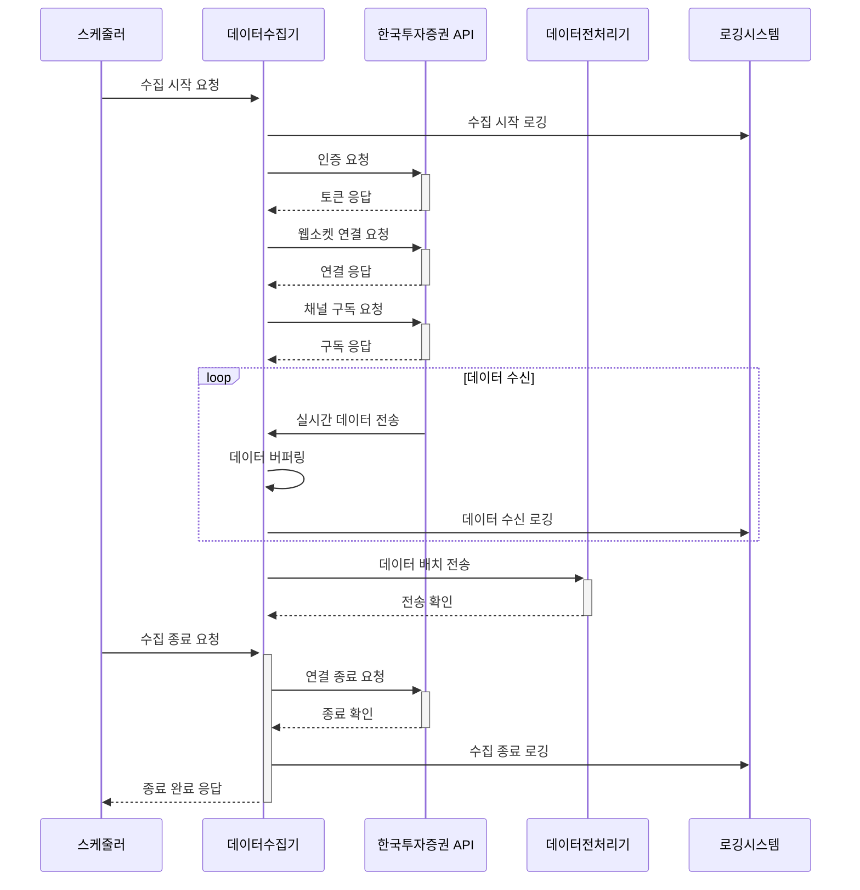
```mermaid
sequenceDiagram
    participant S as 스케줄러
    participant DC as 데이터수집기
    participant API as 한국투자증권 API
    participant DP as 데이터전처리기
    participant L as 로깅시스템
    
    S->>+DC: 수집 시작 요청
    DC->>L: 수집 시작 로깅
    DC->>+API: 인증 요청
    API-->>-DC: 토큰 응답
    DC->>+API: 웹소켓 연결 요청
    API-->>-DC: 연결 응답
    DC->>+API: 채널 구독 요청
    API-->>-DC: 구독 응답
    
    loop 데이터 수신
        API->>DC: 실시간 데이터 전송
        DC->>DC: 데이터 버퍼링
        DC->>L: 데이터 수신 로깅
    end
    
    DC->>+DP: 데이터 배치 전송
    DP-->>-DC: 전송 확인
    
    S->>+DC: 수집 종료 요청
    DC->>+API: 연결 종료 요청
    API-->>-DC: 종료 확인
    DC->>L: 수집 종료 로깅
    DC-->>-S: 종료 완료 응답
```

#### 5.1.3 데이터 수집 클래스 다이어그램

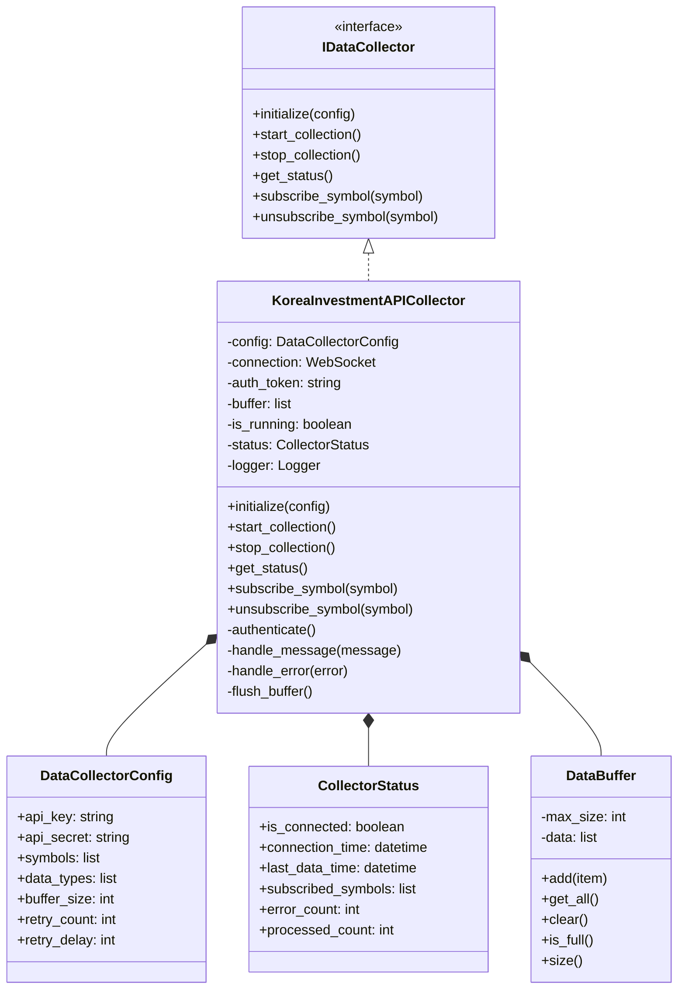
```mermaid
classDiagram
    class IDataCollector {
        <<interface>>
        +initialize(config)
        +start_collection()
        +stop_collection()
        +get_status()
        +subscribe_symbol(symbol)
        +unsubscribe_symbol(symbol)
    }
    
    class DataCollectorConfig {
        +api_key: string
        +api_secret: string
        +symbols: list
        +data_types: list
        +buffer_size: int
        +retry_count: int
        +retry_delay: int
    }
    
    class KoreaInvestmentAPICollector {
        -config: DataCollectorConfig
        -connection: WebSocket
        -auth_token: string
        -buffer: list
        -is_running: boolean
        -status: CollectorStatus
        -logger: Logger
        +initialize(config)
        +start_collection()
        +stop_collection()
        +get_status()
        +subscribe_symbol(symbol)
        +unsubscribe_symbol(symbol)
        -authenticate()
        -handle_message(message)
        -handle_error(error)
        -flush_buffer()
    }
    
    class CollectorStatus {
        +is_connected: boolean
        +connection_time: datetime
        +last_data_time: datetime
        +subscribed_symbols: list
        +error_count: int
        +processed_count: int
    }
    
    class DataBuffer {
        -max_size: int
        -data: list
        +add(item)
        +get_all()
        +clear()
        +is_full()
        +size()
    }
    
    IDataCollector <|.. KoreaInvestmentAPICollector
    KoreaInvestmentAPICollector *-- DataCollectorConfig
    KoreaInvestmentAPICollector *-- CollectorStatus
    KoreaInvestmentAPICollector *-- DataBuffer
```

#### 5.1.4 데이터 수집 컴포넌트 다이어그램

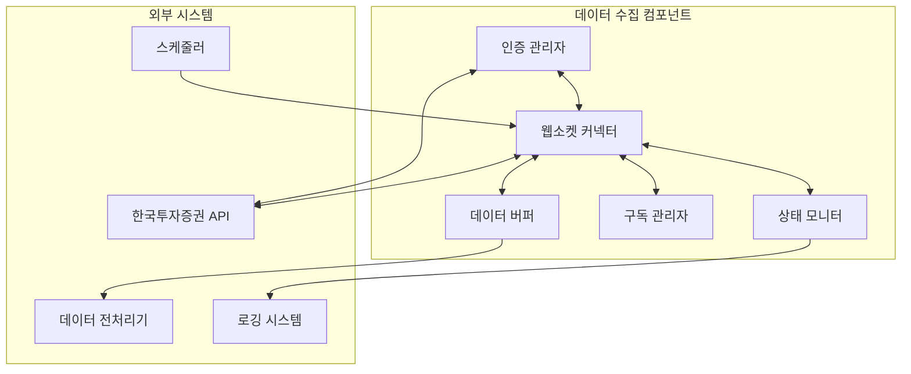
```mermaid
flowchart TB
    subgraph "데이터 수집 컴포넌트"
        DC1[인증 관리자]
        DC2[웹소켓 커넥터]
        DC3[데이터 버퍼]
        DC4[구독 관리자]
        DC5[상태 모니터]
    end
    
    subgraph "외부 시스템"
        ES1[한국투자증권 API]
        ES2[데이터 전처리기]
        ES3[로깅 시스템]
        ES4[스케줄러]
    end
    
    %% 컴포넌트 내부 연결
    DC1 <--> DC2
    DC2 <--> DC3
    DC2 <--> DC4
    DC2 <--> DC5
    
    %% 외부 시스템 연결
    DC1 <--> ES1
    DC2 <--> ES1
    DC3 --> ES2
    DC5 --> ES3
    ES4 --> DC2
```

### 5.2 데이터 전처리 기능

#### 5.2.1 데이터 전처리 플로우차트

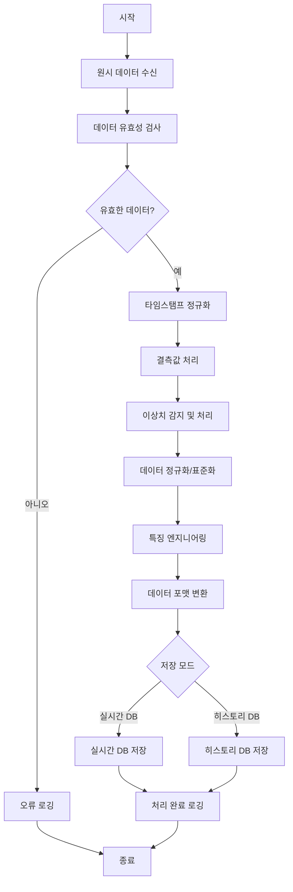
```mermaid
flowchart TD
    A[시작] --> B[원시 데이터 수신]
    B --> C[데이터 유효성 검사]
    C --> D{유효한 데이터?}
    D -->|아니오| E[오류 로깅]
    E --> Z[종료]
    D -->|예| F[타임스탬프 정규화]
    F --> G[결측값 처리]
    G --> H[이상치 감지 및 처리]
    H --> I[데이터 정규화/표준화]
    I --> J[특징 엔지니어링]
    J --> K[데이터 포맷 변환]
    K --> L{저장 모드}
    L -->|실시간 DB| M[실시간 DB 저장]
    L -->|히스토리 DB| N[히스토리 DB 저장]
    M --> O[처리 완료 로깅]
    N --> O
    O --> Z
```

#### 데이터 전처리 기능 설명
데이터 전처리 기능은 수집된 원시 데이터를 학습과 추론에 적합한 형태로 변환하는 역할을 담당합니다. 데이터 유효성 검사, 결측값 처리, 이상치 처리, 정규화 등의 과정을 거쳐 깨끗하고 일관된 데이터를 제공합니다.

#### 데이터 입출력 형태
- **입력 데이터**: 데이터 수집기로부터 받은 원시 데이터 객체 배열
- **출력 데이터**: 전처리된 데이터 객체 배열
  ```json
  {
    "timestamp": "2025-05-20T10:15:30.000000",
    "symbol": "005930",
    "normalized_price": 0.78,
    "normalized_volume": 0.45,
    "price_diff_ratio": 0.002,
    "volume_ma5": 3200,
    "price_ma10": 67450,
    "rsi_14": 65.7,
    "macd": 120.5,
    "macd_signal": 115.2,
    "upper_band": 68200,
    "middle_band": 67500,
    "lower_band": 66800
  }
  ```

#### 5.2.2 데이터 전처리 시퀀스 다이어그램

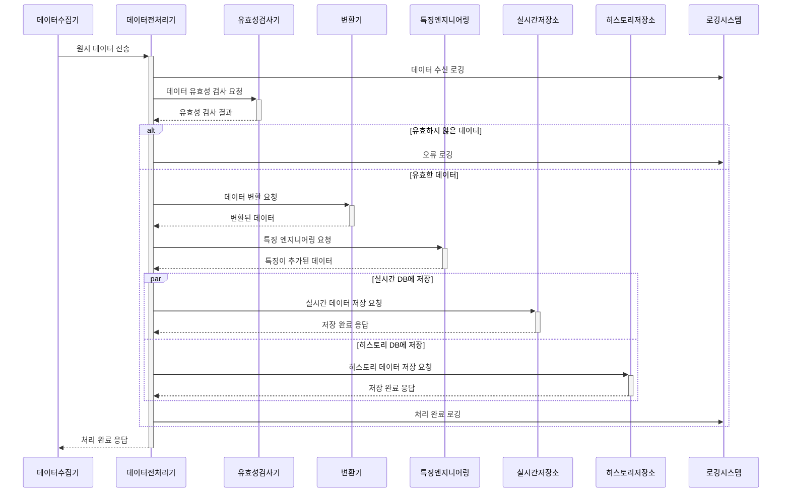
```mermaid
sequenceDiagram
    participant DC as 데이터수집기
    participant DP as 데이터전처리기
    participant V as 유효성검사기
    participant T as 변환기
    participant FE as 특징엔지니어링
    participant RS as 실시간저장소
    participant HS as 히스토리저장소
    participant L as 로깅시스템
    
    DC->>+DP: 원시 데이터 전송
    DP->>L: 데이터 수신 로깅
    DP->>+V: 데이터 유효성 검사 요청
    V-->>-DP: 유효성 검사 결과
    
    alt 유효하지 않은 데이터
        DP->>L: 오류 로깅
    else 유효한 데이터
        DP->>+T: 데이터 변환 요청
        T-->>-DP: 변환된 데이터
        DP->>+FE: 특징 엔지니어링 요청
        FE-->>-DP: 특징이 추가된 데이터
        
        par 실시간 DB에 저장
            DP->>+RS: 실시간 데이터 저장 요청
            RS-->>-DP: 저장 완료 응답
        and 히스토리 DB에 저장
            DP->>+HS: 히스토리 데이터 저장 요청
            HS-->>-DP: 저장 완료 응답
        end
        
        DP->>L: 처리 완료 로깅
    end
    
    DP-->>-DC: 처리 완료 응답
```

#### 5.2.3 데이터 전처리 클래스 다이어그램

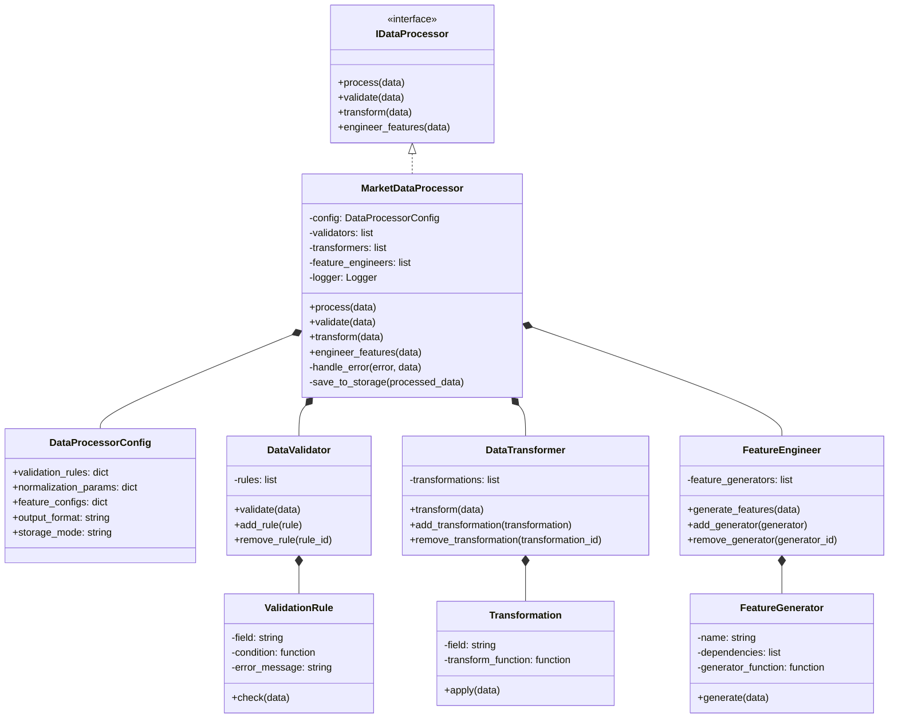
```mermaid
classDiagram
    class IDataProcessor {
        <<interface>>
        +process(data)
        +validate(data)
        +transform(data)
        +engineer_features(data)
    }
    
    class DataProcessorConfig {
        +validation_rules: dict
        +normalization_params: dict
        +feature_configs: dict
        +output_format: string
        +storage_mode: string
    }
    
    class MarketDataProcessor {
        -config: DataProcessorConfig
        -validators: list
        -transformers: list
        -feature_engineers: list
        -logger: Logger
        +process(data)
        +validate(data)
        +transform(data)
        +engineer_features(data)
        -handle_error(error, data)
        -save_to_storage(processed_data)
    }
    
    class DataValidator {
        -rules: list
        +validate(data)
        +add_rule(rule)
        +remove_rule(rule_id)
    }
    
    class DataTransformer {
        -transformations: list
        +transform(data)
        +add_transformation(transformation)
        +remove_transformation(transformation_id)
    }
    
    class FeatureEngineer {
        -feature_generators: list
        +generate_features(data)
        +add_generator(generator)
        +remove_generator(generator_id)
    }
    
    class ValidationRule {
        -field: string
        -condition: function
        -error_message: string
        +check(data)
    }
    
    class Transformation {
        -field: string
        -transform_function: function
        +apply(data)
    }
    
    class FeatureGenerator {
        -name: string
        -dependencies: list
        -generator_function: function
        +generate(data)
    }
    
    IDataProcessor <|.. MarketDataProcessor
    MarketDataProcessor *-- DataProcessorConfig
    MarketDataProcessor *-- DataValidator
    MarketDataProcessor *-- DataTransformer
    MarketDataProcessor *-- FeatureEngineer
    DataValidator *-- ValidationRule
    DataTransformer *-- Transformation
    FeatureEngineer *-- FeatureGenerator
```

#### 5.2.4 데이터 전처리 컴포넌트 다이어그램

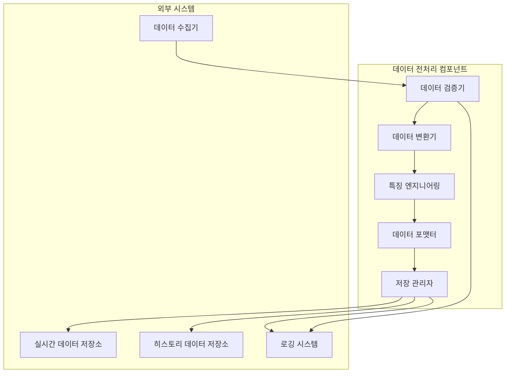
```mermaid
flowchart TB
    subgraph "데이터 전처리 컴포넌트"
        DP1[데이터 검증기]
        DP2[데이터 변환기]
        DP3[특징 엔지니어링]
        DP4[데이터 포맷터]
        DP5[저장 관리자]
    end
    
    subgraph "외부 시스템"
        ES1[데이터 수집기]
        ES2[실시간 데이터 저장소]
        ES3[히스토리 데이터 저장소]
        ES4[로깅 시스템]
    end
    
    %% 컴포넌트 내부 연결
    DP1 --> DP2
    DP2 --> DP3
    DP3 --> DP4
    DP4 --> DP5
    
    %% 외부 시스템 연결
    ES1 --> DP1
    DP5 --> ES2
    DP5 --> ES3
    DP1 --> ES4
    DP5 --> ES4
```

### 5.3 특징 추출 및 모델 학습 기능

#### 5.3.1 특징 추출 및 모델 학습 플로우차트

```mermaid
flowchart TD
    A[시작] --> B[학습 데이터 로드]
    B --> C[데이터 윈도우 생성]
    C --> D[시계열 특징 추출]
    D --> E[기술적 지표 계산]
    E --> F[레이블 생성]
    F --> G[훈련/검증 세트 분리]
    G --> H[모델 초기화/로드]
    H --> I[하이퍼파라미터 설정]
    I --> J[경험 리플레이 버퍼 초기화]
    J --> K[에피소드 시작]
    K --> L[환경 상태 관찰]
    L --> M[행동 선택 (Epsilon-greedy)]
    M --> N[행동 실행 및 보상 계산]
    N --> O[메모리에 경험 저장]
    O --> P[미니배치 샘플링]
    P --> Q[Q-러닝 업데이트]
    Q --> R[정기적으로 타겟 네트워크 업데이트]
    R --> S{종료 조건?}
    S -->|아니오| L
    S -->|예| T[모델 평가]
    T --> U{성능 향상?}
    U -->|아니오| V[이전 모델 유지]
    U -->|예| W[새 모델 저장]
    V --> X[학습 지표 로깅]
    W --> X
    X --> Y[종료]
```

#### 특징 추출 및 모델 학습 기능 설명
특징 추출 및 모델 학습 기능은 전처리된 데이터로부터 학습에 필요한 특징을 추출하고, DQN 강화학습 알고리즘을 사용하여 모델을 학습시키는 역할을 담당합니다. 시계열 데이터에서 의미 있는 패턴을 포착하고, 이를 기반으로 모델이 최적의 거래 결정을 내릴 수 있도록 합니다.

#### 데이터 입출력 형태
- **입력 데이터**: 
  - 전처리된 히스토리 데이터
  - 모델 학습 파라미터 (에폭 수, 배치 크기, 학습률 등)
- **출력 데이터**: 
  - 학습된 DQN 모델
  - 학습 메트릭 (손실, 보상, 정확도 등)
  ```json
  {
    "model_id": "dqn_model_20250520_1215",
    "trained_at": "2025-05-20T12:15:30.000000",
    "epochs": 100,
    "final_loss": 0.0123,
    "avg_reward": 0.875,
    "accuracy": 0.68,
    "sharpe_ratio": 1.45,
    "max_drawdown": 0.12,
    "hyperparameters": {
      "learning_rate": 0.001,
      "gamma": 0.99,
      "epsilon_start": 1.0,
      "epsilon_end": 0.01,
      "epsilon_decay": 0.995
    }
  }
  ```

#### 5.3.2 특징 추출 및 모델 학습 시퀀스 다이어그램

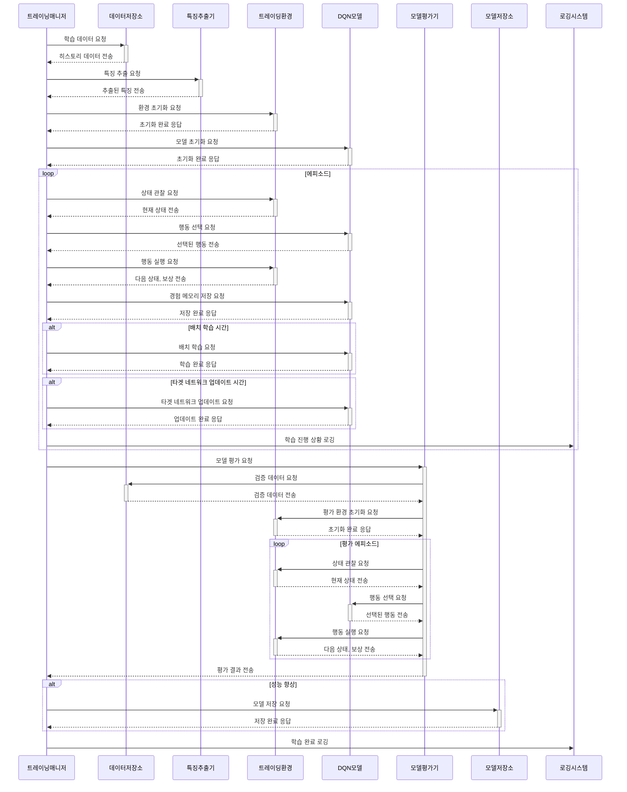
```mermaid
sequenceDiagram
    participant T as 트레이닝매니저
    participant DS as 데이터저장소
    participant FE as 특징추출기
    participant ENV as 트레이딩환경
    participant DQN as DQN모델
    participant ME as 모델평가기
    participant MS as 모델저장소
    participant L as 로깅시스템
    
    T->>+DS: 학습 데이터 요청
    DS-->>-T: 히스토리 데이터 전송
    T->>+FE: 특징 추출 요청
    FE-->>-T: 추출된 특징 전송
    
    T->>+ENV: 환경 초기화 요청
    ENV-->>-T: 초기화 완료 응답
    T->>+DQN: 모델 초기화 요청
    DQN-->>-T: 초기화 완료 응답
    
    loop 에피소드
        T->>+ENV: 상태 관찰 요청
        ENV-->>-T: 현재 상태 전송
        T->>+DQN: 행동 선택 요청
        DQN-->>-T: 선택된 행동 전송
        T->>+ENV: 행동 실행 요청
        ENV-->>-T: 다음 상태, 보상 전송
        T->>+DQN: 경험 메모리 저장 요청
        DQN-->>-T: 저장 완료 응답
        
        alt 배치 학습 시간
            T->>+DQN: 배치 학습 요청
            DQN-->>-T: 학습 완료 응답
        end
        
        alt 타겟 네트워크 업데이트 시간
            T->>+DQN: 타겟 네트워크 업데이트 요청
            DQN-->>-T: 업데이트 완료 응답
        end
        
        T->>L: 학습 진행 상황 로깅
    end
    
    T->>+ME: 모델 평가 요청
    ME->>+DS: 검증 데이터 요청
    DS-->>-ME: 검증 데이터 전송
    ME->>+ENV: 평가 환경 초기화 요청
    ENV-->>-ME: 초기화 완료 응답
    
    loop 평가 에피소드
        ME->>+ENV: 상태 관찰 요청
        ENV-->>-ME: 현재 상태 전송
        ME->>+DQN: 행동 선택 요청
        DQN-->>-ME: 선택된 행동 전송
        ME->>+ENV: 행동 실행 요청
        ENV-->>-ME: 다음 상태, 보상 전송
    end
    
    ME-->>-T: 평가 결과 전송
    
    alt 성능 향상
        T->>+MS: 모델 저장 요청
        MS-->>-T: 저장 완료 응답
    end
    
    T->>L: 학습 완료 로깅
```

#### 5.3.3 특징 추출 및 모델 학습 클래스 다이어그램

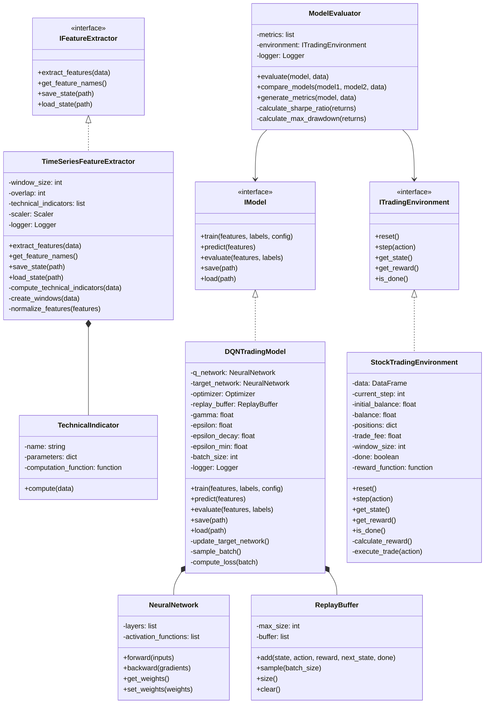
```mermaid
classDiagram
    class IFeatureExtractor {
        <<interface>>
        +extract_features(data)
        +get_feature_names()
        +save_state(path)
        +load_state(path)
    }
    
    class IModel {
        <<interface>>
        +train(features, labels, config)
        +predict(features)
        +evaluate(features, labels)
        +save(path)
        +load(path)
    }
    
    class ITradingEnvironment {
        <<interface>>
        +reset()
        +step(action)
        +get_state()
        +get_reward()
        +is_done()
    }
    
    class TimeSeriesFeatureExtractor {
        -window_size: int
        -overlap: int
        -technical_indicators: list
        -scaler: Scaler
        -logger: Logger
        +extract_features(data)
        +get_feature_names()
        +save_state(path)
        +load_state(path)
        -compute_technical_indicators(data)
        -create_windows(data)
        -normalize_features(features)
    }
    
    class TechnicalIndicator {
        -name: string
        -parameters: dict
        -computation_function: function
        +compute(data)
    }
    
    class DQNTradingModel {
        -q_network: NeuralNetwork
        -target_network: NeuralNetwork
        -optimizer: Optimizer
        -replay_buffer: ReplayBuffer
        -gamma: float
        -epsilon: float
        -epsilon_decay: float
        -epsilon_min: float
        -batch_size: int
        -logger: Logger
        +train(features, labels, config)
        +predict(features)
        +evaluate(features, labels)
        +save(path)
        +load(path)
        -update_target_network()
        -sample_batch()
        -compute_loss(batch)
    }
    
    class NeuralNetwork {
        -layers: list
        -activation_functions: list
        +forward(inputs)
        +backward(gradients)
        +get_weights()
        +set_weights(weights)
    }
    
    class ReplayBuffer {
        -max_size: int
        -buffer: list
        +add(state, action, reward, next_state, done)
        +sample(batch_size)
        +size()
        +clear()
    }
    
    class StockTradingEnvironment {
        -data: DataFrame
        -current_step: int
        -initial_balance: float
        -balance: float
        -positions: dict
        -trade_fee: float
        -window_size: int
        -done: boolean
        -reward_function: function
        +reset()
        +step(action)
        +get_state()
        +get_reward()
        +is_done()
        -calculate_reward()
        -execute_trade(action)
    }
    
    class ModelEvaluator {
        -metrics: list
        -environment: ITradingEnvironment
        -logger: Logger
        +evaluate(model, data)
        +compare_models(model1, model2, data)
        +generate_metrics(model, data)
        -calculate_sharpe_ratio(returns)
        -calculate_max_drawdown(returns)
    }
    
    IFeatureExtractor <|.. TimeSeriesFeatureExtractor
    IModel <|.. DQNTradingModel
    ITradingEnvironment <|.. StockTradingEnvironment
    
    TimeSeriesFeatureExtractor *-- TechnicalIndicator
    DQNTradingModel *-- NeuralNetwork
    DQNTradingModel *-- ReplayBuffer
    ModelEvaluator --> ITradingEnvironment
    ModelEvaluator --> IModel
```

#### 5.3.4 특징 추출 및 모델 학습 컴포넌트 다이어그램

```mermaid
flowchart TB
    subgraph "특징 추출 컴포넌트"
        FE1[데이터 윈도우 생성기]
        FE2[기술적 지표 계산기]
        FE3[특징 정규화기]
        FE4[레이블 생성기]
    end
    
    subgraph "모델 학습 컴포넌트"
        ML1[DQN 신경망]
        ML2[경험 리플레이 버퍼]
        ML3[타겟 네트워크]
        ML4[학습 스케줄러]
    end
    
    subgraph "환경 컴포넌트"
        ENV1[상태 관리자]
        ENV2[액션 처리기]
        ENV3[보상 계산기]
        ENV4[거래 시뮬레이터]
    end
    
    subgraph "평가 컴포넌트"
        EV1[퍼포먼스 계산기]
        EV2[모델 비교기]
        EV3[백테스트 엔진]
    end
    
    subgraph "외부 시스템"
        ES1[데이터 저장소]
        ES2[모델 저장소]
        ES3[로깅 시스템]
    end
    
    %% 특징 추출 컴포넌트 내부 연결
    FE1 --> FE2
    FE2 --> FE3
    FE3 --> FE4
    
    %% 모델 학습 컴포넌트 내부 연결
    ML1 <--> ML2
    ML1 --> ML3
    ML4 --> ML1
    ML4 --> ML3
    
    %% 환경 컴포넌트 내부 연결
    ENV1 --> ENV2
    ENV2 --> ENV3
    ENV3 --> ENV4
    ENV4 --> ENV1
    
    %% 컴포넌트 간 연결
    ES1 --> FE1
    FE4 --> ML1
    ML1 --> ENV2
    ENV3 --> ML2
    ML1 --> EV1
    
    %% 외부 시스템 연결
    EV1 --> ES2
    ML1 --> ES2
    ES3 <-- ML4
```

### 5.4 추론 및 거래 신호 생성 기능

#### 5.4.1 추론 및 거래 신호 생성 플로우차트

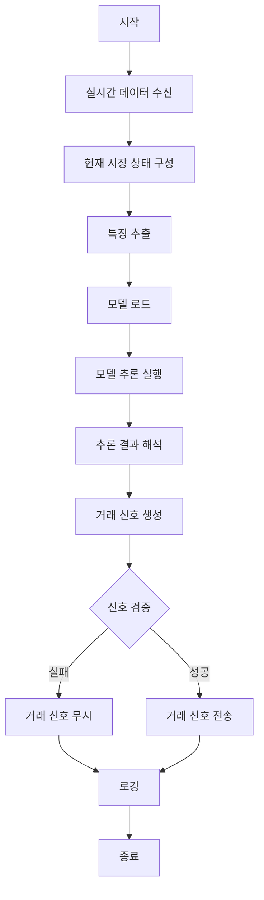
```mermaid
flowchart TD
    A[시작] --> B[실시간 데이터 수신]
    B --> C[현재 시장 상태 구성]
    C --> D[특징 추출]
    D --> E[모델 로드]
    E --> F[모델 추론 실행]
    F --> G[추론 결과 해석]
    G --> H[거래 신호 생성]
    H --> I{신호 검증}
    I -->|실패| J[거래 신호 무시]
    I -->|성공| K[거래 신호 전송]
    J --> L[로깅]
    K --> L
    L --> M[종료]
```

#### 추론 및 거래 신호 생성 기능 설명
추론 및 거래 신호 생성 기능은 실시간 데이터를 기반으로 학습된 DQN 모델을 사용하여 최적의 거래 행동을 예측하고, 이를 거래 신호로 변환하는 역할을 담당합니다. 생성된 거래 신호는 거래 실행 전에 검증을 거쳐 안전성을 확보합니다.

#### 데이터 입출력 형태
- **입력 데이터**: 
  - 실시간 전처리된 데이터
  - 로드된 DQN 모델
- **출력 데이터**: 
  - 거래 신호 객체
  ```json
  {
    "signal_id": "sig_20250520_101530_005930",
    "timestamp": "2025-05-20T10:15:30.000000",
    "symbol": "005930",
    "action": "BUY",  // BUY, SELL, HOLD
    "confidence": 0.85,
    "quantity": 10,
    "target_price": 67800,
    "stop_loss": 67000,
    "take_profit": 69000,
    "model_id": "dqn_model_20250520_0800",
    "features": {
      "rsi_14": 65.7,
      "macd": 120.5,
      "price_ma10": 67450
    }
  }
  ```

#### 5.4.2 추론 및 거래 신호 생성 시퀀스 다이어그램

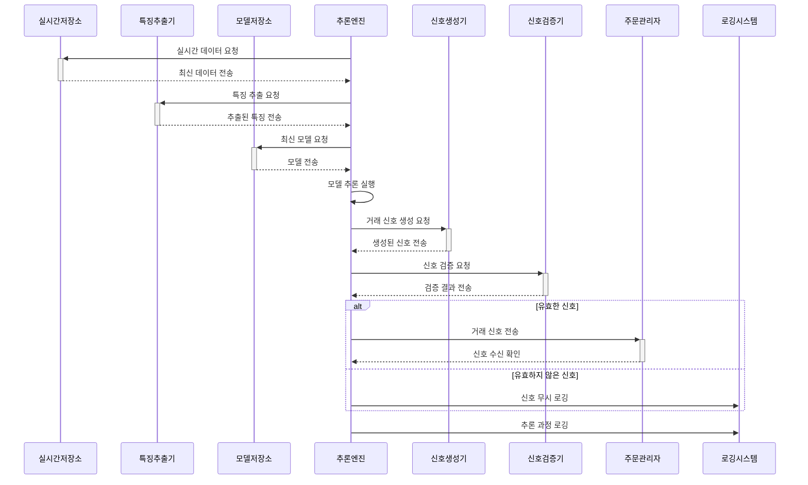
```mermaid
sequenceDiagram
    participant RS as 실시간저장소
    participant FE as 특징추출기
    participant MS as 모델저장소
    participant IE as 추론엔진
    participant SG as 신호생성기
    participant SV as 신호검증기
    participant OM as 주문관리자
    participant L as 로깅시스템
    
    IE->>+RS: 실시간 데이터 요청
    RS-->>-IE: 최신 데이터 전송
    IE->>+FE: 특징 추출 요청
    FE-->>-IE: 추출된 특징 전송
    IE->>+MS: 최신 모델 요청
    MS-->>-IE: 모델 전송
    
    IE->>IE: 모델 추론 실행
    IE->>+SG: 거래 신호 생성 요청
    SG-->>-IE: 생성된 신호 전송
    IE->>+SV: 신호 검증 요청
    SV-->>-IE: 검증 결과 전송
    
    alt 유효한 신호
        IE->>+OM: 거래 신호 전송
        OM-->>-IE: 신호 수신 확인
    else 유효하지 않은 신호
        IE->>L: 신호 무시 로깅
    end
    
    IE->>L: 추론 과정 로깅
```

#### 5.4.3 추론 및 거래 신호 생성 클래스 다이어그램

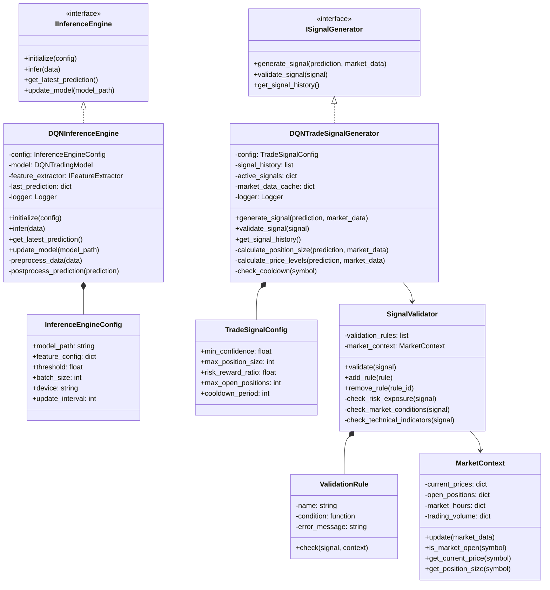
```mermaid
classDiagram
    class IInferenceEngine {
        <<interface>>
        +initialize(config)
        +infer(data)
        +get_latest_prediction()
        +update_model(model_path)
    }
    
    class ISignalGenerator {
        <<interface>>
        +generate_signal(prediction, market_data)
        +validate_signal(signal)
        +get_signal_history()
    }
    
    class InferenceEngineConfig {
        +model_path: string
        +feature_config: dict
        +threshold: float
        +batch_size: int
        +device: string
        +update_interval: int
    }
    
    class DQNInferenceEngine {
        -config: InferenceEngineConfig
        -model: DQNTradingModel
        -feature_extractor: IFeatureExtractor
        -last_prediction: dict
        -logger: Logger
        +initialize(config)
        +infer(data)
        +get_latest_prediction()
        +update_model(model_path)
        -preprocess_data(data)
        -postprocess_prediction(prediction)
    }
    
    class TradeSignalConfig {
        +min_confidence: float
        +max_position_size: int
        +risk_reward_ratio: float
        +max_open_positions: int
        +cooldown_period: int
    }
    
    class DQNTradeSignalGenerator {
        -config: TradeSignalConfig
        -signal_history: list
        -active_signals: dict
        -market_data_cache: dict
        -logger: Logger
        +generate_signal(prediction, market_data)
        +validate_signal(signal)
        +get_signal_history()
        -calculate_position_size(prediction, market_data)
        -calculate_price_levels(prediction, market_data)
        -check_cooldown(symbol)
    }
    
    class SignalValidator {
        -validation_rules: list
        -market_context: MarketContext
        +validate(signal)
        +add_rule(rule)
        +remove_rule(rule_id)
        -check_risk_exposure(signal)
        -check_market_conditions(signal)
        -check_technical_indicators(signal)
    }
    
    class ValidationRule {
        -name: string
        -condition: function
        -error_message: string
        +check(signal, context)
    }
    
    class MarketContext {
        -current_prices: dict
        -open_positions: dict
        -market_hours: dict
        -trading_volume: dict
        +update(market_data)
        +is_market_open(symbol)
        +get_current_price(symbol)
        +get_position_size(symbol)
    }
    
    IInferenceEngine <|.. DQNInferenceEngine
    ISignalGenerator <|.. DQNTradeSignalGenerator
    DQNInferenceEngine *-- InferenceEngineConfig
    DQNTradeSignalGenerator *-- TradeSignalConfig
    DQNTradeSignalGenerator --> SignalValidator
    SignalValidator *-- ValidationRule
    SignalValidator --> MarketContext
```

#### 5.4.4 추론 및 거래 신호 생성 컴포넌트 다이어그램

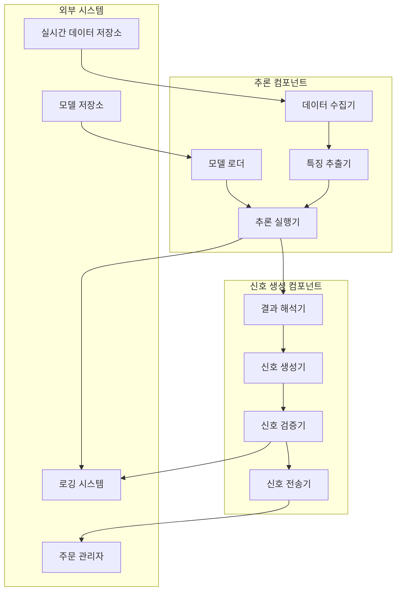
```mermaid
flowchart TB
    subgraph "추론 컴포넌트"
        IN1[데이터 수집기]
        IN2[특징 추출기]
        IN3[모델 로더]
        IN4[추론 실행기]
    end
    
    subgraph "신호 생성 컴포넌트"
        SG1[결과 해석기]
        SG2[신호 생성기]
        SG3[신호 검증기]
        SG4[신호 전송기]
    end
    
    subgraph "외부 시스템"
        ES1[실시간 데이터 저장소]
        ES2[모델 저장소]
        ES3[주문 관리자]
        ES4[로깅 시스템]
    end
    
    %% 추론 컴포넌트 내부 연결
    IN1 --> IN2
    IN2 --> IN4
    IN3 --> IN4
    
    %% 신호 생성 컴포넌트 내부 연결
    SG1 --> SG2
    SG2 --> SG3
    SG3 --> SG4
    
    %% 컴포넌트 간 연결
    IN4 --> SG1
    
    %% 외부 시스템 연결
    ES1 --> IN1
    ES2 --> IN3
    SG4 --> ES3
    IN4 --> ES4
    SG3 --> ES4
```

### 5.5 거래 실행 기능

#### 5.5.1 거래 실행 플로우차트

```mermaid
flowchart TD
    A[시작] --> B[거래 신호 수신]
    B --> C[주문 생성]
    C --> D[위험 관리 검사]
    D --> E{위험 허용 범위?}
    E -->|아니오| F[주문 거부]
    E -->|예| G[주문 최적화]
    G --> H[API 인증]
    H --> I{인증 성공?}
    I -->|아니오| J[인증 재시도]
    J --> H
    I -->|예| K[주문 전송]
    K --> L{주문 접수 성공?}
    L -->|아니오| M[오류 처리]
    L -->|예| N[주문 상태 모니터링]
    N --> O{주문 체결?}
    O -->|아니오| P[대기]
    P --> N
    O -->|예| Q[거래 결과 저장]
    F --> R[거부 사유 로깅]
    M --> R
    Q --> R
    R --> S[종료]
```

#### 거래 실행 기능 설명
거래 실행 기능은 생성된 거래 신호를 기반으로 실제 거래를 실행하는 역할을 담당합니다. 주문 생성, 위험 관리, 주문 최적화, API를 통한 주문 전송 및 체결 상태 모니터링 등의 과정을 포함합니다.

#### 데이터 입출력 형태
- **입력 데이터**: 
  - 거래 신호 객체
  - 위험 관리 파라미터
  - API 인증 정보
- **출력 데이터**: 
  - 거래 실행 결과 객체
  ```json
  {
    "execution_id": "exec_20250520_101535_005930",
    "signal_id": "sig_20250520_101530_005930",
    "timestamp": "2025-05-20T10:15:35.000000",
    "symbol": "005930",
    "action": "BUY",
    "quantity": 10,
    "executed_price": 67850,
    "order_type": "LIMIT",
    "status": "FILLED",
    "fee": 339.25,
    "total_amount": 678500,
    "exchange_order_id": "KIS12345678",
    "execution_time": "2025-05-20T10:15:38.123456"
  }
  ```

#### 5.5.2 거래 실행 시퀀스 다이어그램

```mermaid
sequenceDiagram
    participant SG as 신호생성기
    participant OM as 주문관리자
    participant RM as 위험관리자
    participant OO as 주문최적화기
    participant TE as 거래실행기
    participant API as 한국투자증권API
    participant DS as 데이터저장소
    participant L as 로깅시스템
    
    SG->>+OM: 거래 신호 전송
    OM->>L: 신호 수신 로깅
    OM->>OM: 주문 객체 생성
    OM->>+RM: 위험 평가 요청
    RM-->>-OM: 위험 평가 결과
    
    alt 위험 허용 범위
        OM->>+OO: 주문 최적화 요청
        OO-->>-OM: 최적화된 주문
        OM->>+TE: 거래 실행 요청
        TE->>L: 실행 시작 로깅
        TE->>+API: 인증 요청
        API-->>-TE: 인증 토큰 응답
        TE->>+API: 주문 전송
        API-->>-TE: 주문 접수 응답
        
        loop 주문 상태 확인
            TE->>+API: 주문 상태 조회
            API-->>-TE: 주문 상태 응답
            
            alt 주문 체결
                TE->>+DS: 거래 결과 저장
                DS-->>-TE: 저장 완료 응답
                TE->>L: 체결 완료 로깅
                TE-->>-OM: 실행 결과 응답
            else 주문 대기 중
                TE->>L: 대기 상태 로깅
            end
        end
    else 위험 초과
        OM->>L: 주문 거부 로깅
        OM-->>-SG: 거부 사유 응답
    end
```

#### 5.5.3 거래 실행 클래스 다이어그램

```mermaid
classDiagram
    class IOrderManager {
        <<interface>>
        +create_order(signal)
        +validate_order(order)
        +update_order(id, data)
        +cancel_order(id)
        +get_order_status(id)
    }
    
    class IRiskManager {
        <<interface>>
        +evaluate_risk(order)
        +apply_constraints(order)
        +get_risk_metrics()
        +update_risk_profile(profile)
    }
    
    class ITradeExecutor {
        <<interface>>
        +execute_trade(order)
        +get_trade_status(id)
        +cancel_trade(id)
        +get_execution_history()
    }
    
    class OrderManagerConfig {
        +default_order_type: string
        +time_in_force: string
        +allowed_symbols: list
        +max_order_value: float
        +min_order_value: float
    }
    
    class StockOrderManager {
        -config: OrderManagerConfig
        -active_orders: dict
        -order_history: list
        -risk_manager: IRiskManager
        -logger: Logger
        +create_order(signal)
        +validate_order(order)
        +update_order(id, data)
        +cancel_order(id)
        +get_order_status(id)
        -generate_order_id()
        -convert_signal_to_order(signal)
    }
    
    class Order {
        -id: string
        -signal_id: string
        -symbol: string
        -action: string
        -quantity: int
        -price: float
        -order_type: string
        -status: string
        -created_at: datetime
        -updated_at: datetime
        +to_dict()
        +from_dict(data)
        +update_status(status)
    }
    
    class RiskManagerConfig {
        +max_position_size: dict
        +max_exposure: float
        +max_drawdown: float
        +volatility_limits: dict
        +correlation_limits: dict
    }
    
    class PortfolioRiskManager {
        -config: RiskManagerConfig
        -portfolio: Portfolio
        -market_data_provider: IMarketDataProvider
        -risk_models: list
        -logger: Logger
        +evaluate_risk(order)
        +apply_constraints(order)
        +get_risk_metrics()
        +update_risk_profile(profile)
        -check_position_limits(order)
        -check_exposure_limits(order)
        -check_volatility(order)
        -calculate_var(portfolio)
    }
    
    class Portfolio {
        -positions: dict
        -cash: float
        -historical_value: list
        +add_position(symbol, quantity, price)
        +remove_position(symbol, quantity, price)
        +get_position(symbol)
        +get_total_value()
        +get_metrics()
        +update_prices(price_dict)
    }
    
    class TradeExecutorConfig {
        +api_key: string
        +api_secret: string
        +base_url: string
        +timeout: int
        +max_retries: int
        +retry_delay: int
    }
    
    class KoreaInvestmentTradeExecutor {
        -config: TradeExecutorConfig
        -connection: ApiConnection
        -execution_history: list
        -active_trades: dict
        -logger: Logger
        +execute_trade(order)
        +get_trade_status(id)
        +cancel_trade(id)
        +get_execution_history()
        -authenticate()
        -prepare_order_payload(order)
        -handle_response(response)
        -monitor_order_status(order_id)
    }
    
    class ApiConnection {
        -base_url: string
        -headers: dict
        -timeout: int
        -session: HttpSession
        +connect()
        +disconnect()
        +send_request(method, endpoint, data)
        +is_connected()
        -handle_error(error)
    }
    
    IOrderManager <|.. StockOrderManager
    IRiskManager <|.. PortfolioRiskManager
    ITradeExecutor <|.. KoreaInvestmentTradeExecutor
    
    StockOrderManager *-- OrderManagerConfig
    StockOrderManager *-- Order
    StockOrderManager --> IRiskManager
    
    PortfolioRiskManager *-- RiskManagerConfig
    PortfolioRiskManager *-- Portfolio
    
    KoreaInvestmentTradeExecutor *-- TradeExecutorConfig
    KoreaInvestmentTradeExecutor *-- ApiConnection
```

#### 5.5.4 거래 실행 컴포넌트 다이어그램

```mermaid
flowchart TB
    subgraph "주문 관리 컴포넌트"
        OM1[주문 생성기]
        OM2[주문 검증기]
        OM3[주문 상태 관리자]
        OM4[주문 이력 관리자]
    end
    
    subgraph "위험 관리 컴포넌트"
        RM1[포지션 제한 검사기]
        RM2[노출도 분석기]
        RM3[시장 상황 분석기]
        RM4[포트폴리오 관리자]
    end
    
    subgraph "거래 실행 컴포넌트"
        TE1[API 인증 관리자]
        TE2[주문 실행기]
        TE3[상태 모니터링]
        TE4[결과 처리기]
    end
    
    subgraph "외부 시스템"
        ES1[신호 생성기]
        ES2[한국투자증권 API]
        ES3[데이터 저장소]
        ES4[로깅 시스템]
    end
    
    %% 주문 관리 컴포넌트 내부 연결
    OM1 --> OM2
    OM2 --> OM3
    OM3 --> OM4
    
    %% 위험 관리 컴포넌트 내부 연결
    RM1 --> RM4
    RM2 --> RM4
    RM3 --> RM4
    
    %% 거래 실행 컴포넌트 내부 연결
    TE1 --> TE2
    TE2 --> TE3
    TE3 --> TE4
    
    %% 컴포넌트 간 연결
    ES1 --> OM1
    OM2 --> RM1
    OM3 --> TE1
    TE4 --> OM3
    
    %% 외부 시스템 연결
    TE2 --> ES2
    TE3 --> ES2
    TE4 --> ES3
    OM4 --> ES4
    RM4 --> ES4
    TE4 --> ES4
```

### 5.6 모니터링 및 알림 기능

#### 5.6.1 모니터링 및 알림 플로우차트

```mermaid
flowchart TD
    A[시작] --> B[시스템 설정 로드]
    B --> C[모니터링 클라이언트 초기화]
    C --> D[메트릭 정의]
    D --> E[알림 규칙 설정]
    E --> F[데이터 소스 연결]
    F --> G[메트릭 수집 시작]
    G --> H[수집된 데이터 처리]
    H --> I{알림 조건 충족?}
    I -->|아니오| J[대시보드 업데이트]
    I -->|예| K[알림 생성]
    K --> L[알림 전송]
    J --> M{종료 신호?}
    L --> M
    M -->|아니오| G
    M -->|예| N[자원 정리]
    N --> O[종료]
```

#### 모니터링 및 알림 기능 설명
모니터링 및 알림 기능은 전체 시스템의 상태를 실시간으로 추적하고, 중요한 이벤트나 문제가 발생했을 때 관리자에게 알림을 전송하는 역할을 담당합니다. 시스템 성능, 거래 실행, 모델 성능 등 다양한 지표를 수집하고 시각화합니다.

#### 데이터 입출력 형태
- **입력 데이터**: 
  - 시스템 각 컴포넌트의 상태 및 성능 메트릭
  - 로그 데이터
  - 트레이딩 결과 데이터
- **출력 데이터**: 
  - 모니터링 대시보드
  - 알림 메시지
  ```json
  {
    "alert_id": "alert_20250520_101540",
    "timestamp": "2025-05-20T10:15:40.000000",
    "severity": "WARNING",
    "component": "KoreaInvestmentAPICollector",
    "message": "API 응답 지연 감지: 평균 응답 시간이 500ms를 초과했습니다.",
    "metrics": {
      "avg_response_time": 650,
      "threshold": 500
    },
    "status": "ACTIVE"
  }
  ```

#### 5.6.2 모니터링 및 알림 시퀀스 다이어그램

```mermaid
sequenceDiagram
    participant MC as 모니터링클라이언트
    participant CO as 시스템컴포넌트
    participant MA as 메트릭수집기
    participant DB as 모니터링DB
    participant AP as 알림프로세서
    participant DS as 대시보드서버
    participant NU as 알림유틸리티
    participant U as 사용자
    
    MC->>MC: 초기화
    MC->>+CO: 메트릭 구독
    CO-->>-MC: 구독 확인
    
    loop 메트릭 수집
        CO->>+MA: 메트릭 전송
        MA->>MA: 메트릭 처리
        MA->>+DB: 메트릭 저장
        DB-->>-MA: 저장 확인
        MA->>+AP: 메트릭 분석 요청
        AP-->>-MA: 분석 결과
        MA-->>-CO: 수집 확인
        
        alt 알림 조건 충족
            AP->>+NU: 알림 생성 요청
            NU->>NU: 알림 메시지 생성
            NU->>+U: 알림 전송
            U-->>-NU: 수신 확인
            NU-->>-AP: 알림 전송 완료
        end
        
        MA->>+DS: 대시보드 업데이트
        DS-->>-MA: 업데이트 확인
        U->>+DS: 대시보드 조회
        DS-->>-U: 대시보드 데이터 전송
    end
```

#### 5.6.3 모니터링 및 알림 클래스 다이어그램

```mermaid
classDiagram
    class IMonitoring {
        <<interface>>
        +register_metric(name, type)
        +update_metric(name, value)
        +get_metrics()
        +set_alert(metric, condition)
    }
    
    class MonitoringConfig {
        +metrics: list
        +collection_interval: int
        +storage_retention: string
        +dashboard_url: string
        +alert_channels: list
    }
    
    class GrafanaPrometheusMonitoring {
        -config: MonitoringConfig
        -prometheus_client: PrometheusClient
        -grafana_client: GrafanaClient
        -metrics: dict
        -alerts: dict
        -logger: Logger
        +register_metric(name, type)
        +update_metric(name, value)
        +get_metrics()
        +set_alert(metric, condition)
        -initialize_clients()
        -create_dashboard()
    }
    
    class PrometheusClient {
        -url: string
        -port: int
        -metrics: dict
        +connect()
        +disconnect()
        +create_metric(name, type, description)
        +update_metric(name, value, labels)
        +query_metric(name, time_range)
    }
    
    class GrafanaClient {
        -url: string
        -api_key: string
        -dashboards: list
        +connect()
        +disconnect()
        +create_dashboard(name, panels)
        +update_dashboard(id, panels)
        +get_dashboard(id)
        +create_alert(dashboard_id, panel_id, condition)
    }
    
    class MetricCollector {
        -collectors: dict
        -collection_interval: int
        -running: boolean
        +start_collection()
        +stop_collection()
        +add_collector(component, collector_function)
        +remove_collector(component)
        -collect_metrics()
    }
    
    class AlertProcessor {
        -alert_rules: list
        -alert_history: list
        -notification_channels: list
        +process_metrics(metrics)
        +add_rule(rule)
        +remove_rule(rule_id)
        +get_active_alerts()
        -check_rule(rule, metrics)
        -create_alert(rule, metrics)
    }
    
    class AlertRule {
        -id: string
        -metric_name: string
        -condition: function
        -severity: string
        -message_template: string
        -cooldown: int
        -last_triggered: datetime
        +evaluate(metric_value)
        +is_in_cooldown()
        +get_message(metric_value)
    }
    
    class NotificationChannel {
        -type: string
        -config: dict
        -enabled: boolean
        +send(alert)
        +test_connection()
        +enable()
        +disable()
    }
    
    IMonitoring <|.. GrafanaPrometheusMonitoring
    GrafanaPrometheusMonitoring *-- MonitoringConfig
    GrafanaPrometheusMonitoring *-- PrometheusClient
    GrafanaPrometheusMonitoring *-- GrafanaClient
    GrafanaPrometheusMonitoring *-- MetricCollector
    GrafanaPrometheusMonitoring *-- AlertProcessor
    AlertProcessor *-- AlertRule
    AlertProcessor *-- NotificationChannel
```

#### 5.6.4 모니터링 및 알림 컴포넌트 다이어그램

```mermaid
flowchart TB
    subgraph "메트릭 수집 컴포넌트"
        MC1[시스템 메트릭 수집기]
        MC2[애플리케이션 메트릭 수집기]
        MC3[거래 메트릭 수집기]
        MC4[모델 성능 메트릭 수집기]
    end
    
    subgraph "알림 처리 컴포넌트"
        AP1[알림 규칙 평가기]
        AP2[알림 생성기]
        AP3[알림 라우터]
        AP4[알림 상태 관리자]
    end
    
    subgraph "대시보드 컴포넌트"
        DB1[데이터 가공기]
        DB2[차트 생성기]
        DB3[대시보드 레이아웃 관리자]
        DB4[사용자 인터페이스]
    end
    
    subgraph "외부 시스템"
        ES1[Prometheus]
        ES2[Grafana]
        ES3[알림 채널(이메일, SMS)]
        ES4[로깅 시스템]
    end
    
    %% 메트릭 수집 컴포넌트 내부 연결
    MC1 --> ES1
    MC2 --> ES1
    MC3 --> ES1
    MC4 --> ES1
    
    %% 알림 처리 컴포넌트 내부 연결
    AP1 --> AP2
    AP2 --> AP3
    AP3 --> AP4
    
    %% 대시보드 컴포넌트 내부 연결
    DB1 --> DB2
    DB2 --> DB3
    DB3 --> DB4
    
    %% 컴포넌트 간 연결
    ES1 --> AP1
    ES1 --> DB1
    
    %% 외부 시스템 연결
    AP3 --> ES3
    DB3 --> ES2
    AP4 --> ES4
    ES2 --> DB4
```

## 6. 종합 설계 고려사항

### 6.1 시스템 확장성 및 성능 고려사항

실시간 주식 트레이딩 시스템은 대량의 데이터를 빠르게 처리해야 하며, 확장성과 성능을 고려한 설계가 필요합니다:

1. **비동기 처리**: 데이터 수집, 전처리, 모델 학습 등의 작업을 비동기적으로 처리하여 시스템 전체의 응답성을 향상시킵니다.
2. **메시지 큐**: 컴포넌트 간 통신에 메시지 큐를 사용하여 부하 분산과 안정성을 확보합니다.
3. **캐싱**: 자주 액세스되는 데이터를 캐시하여 데이터베이스 부하를 줄이고 응답 시간을 개선합니다.
4. **수평적 확장**: 각 컴포넌트가 독립적으로 확장 가능하도록 설계하여 필요에 따라 리소스를 추가할 수 있습니다.
5. **배치 처리**: 적절한 경우 데이터를 배치로 처리하여 I/O 작업을 최적화합니다.

### 6.2 보안 고려사항

금융 데이터와 거래를 다루는 시스템으로서 보안은 매우 중요한 고려사항입니다:

1. **API 키 관리**: 한국투자증권 API 키와 같은 민감한 정보는 안전하게 관리해야 합니다.
2. **암호화**: 데이터 전송 및 저장 시 암호화를 사용하여 정보를 보호합니다.
3. **접근 제어**: 역할 기반 접근 제어를 통해 권한을 세밀하게 관리합니다.
4. **감사 로깅**: 모든 중요 작업에 대한 감사 로그를 유지하여 문제 발생 시 추적할 수 있습니다.
5. **안전한 인증**: 다중 인증과 같은 안전한 인증 방식을 사용합니다.

### 6.3 장애 복구 고려사항

시스템 장애로 인한 금전적 손실을 방지하기 위한 장애 복구 전략이 필요합니다:

1. **상태 백업**: 시스템 상태와 중요 데이터를 정기적으로 백업합니다.
2. **자동 복구**: 장애 감지 시 자동으로 복구할 수 있는 메커니즘을 구현합니다.
3. **장애 격리**: 한 컴포넌트의 장애가 전체 시스템에 영향을 미치지 않도록 격리합니다.
4. **대체 API 엔드포인트**: API 연결 실패 시 대체 엔드포인트로 전환할 수 있도록 준비합니다.
5. **긴급 중지 메커니즘**: 심각한 문제 발생 시 시스템을 안전하게 중지할 수 있는 기능을 구현합니다.

### 6.4 모니터링 데이터 처리 및 저장

모니터링 데이터는 시스템 운영과 개선에 중요한 정보를 제공합니다:

1. **시계열 데이터베이스**: Prometheus, InfluxDB 등의 시계열 데이터베이스를 사용하여 메트릭 데이터를 효율적으로 저장합니다.
2. **데이터 보존 정책**: 데이터 양과 중요도에 따라 보존 기간을 설정합니다.
3. **집계 및 다운샘플링**: 오래된 데이터는 집계하여 저장 공간을 절약합니다.
4. **알림 기록**: 발생한 알림의 기록을 유지하여 패턴을 분석합니다.
5. **대시보드 설계**: 정보를 직관적으로 파악할 수 있는 대시보드를 설계합니다.

### 6.5 한글 처리 고려사항

한국 시장 데이터를 다루기 때문에 한글 처리에 대한 고려가 필요합니다:

1. **인코딩**: 모든 데이터 처리 과정에서 UTF-8 인코딩을 사용하여 한글이 깨지지 않도록 합니다.
2. **폰트 지원**: 모니터링 대시보드 등의 UI에서 한글 폰트를 지원해야 합니다.
3. **텍스트 정규화**: 한글 텍스트 데이터(뉴스, 공시 등)를 처리할 때 적절한 정규화 과정을 거칩니다.
4. **로깅**: 로그 파일에 한글이 포함될 때 올바르게 처리되도록 설정합니다.
5. **API 응답 처리**: 한국투자증권 API에서 받은 한글 데이터를 올바르게 처리합니다.

## 7. 결론

본 문서는 한국투자증권 API를 활용한 실시간 주식 트레이딩 시스템의 설계를 위한 상세한 분석과 다이어그램을 제공했습니다. 파이썬 3.10과 PyTorch 2.1.1+cu118을 기반으로 하여 DQN 강화학습 알고리즘을 사용한 트레이딩 시스템의 아키텍처를 설계했습니다.

주요 기능 단위별 플로우차트, 시퀀스 다이어그램, 클래스 다이어그램, 컴포넌트 다이어그램을 통해 시스템의 모든 측면을 문서화했으며, 각 기능의 입출력 데이터 형태와 상세한 설명을 포함하였습니다.

인터페이스 기반 설계를 적용하여 모델 업데이트와 시스템 확장성을 확보했으며, 철저한 로깅과 모니터링을 통해 시스템의 안정성과 성능을 보장하도록 설계했습니다.

이 설계 문서를 기반으로 실제 구현을 진행하면, 효율적이고 안정적인 실시간 주식 트레이딩 시스템을 구축할 수 있을 것입니다.