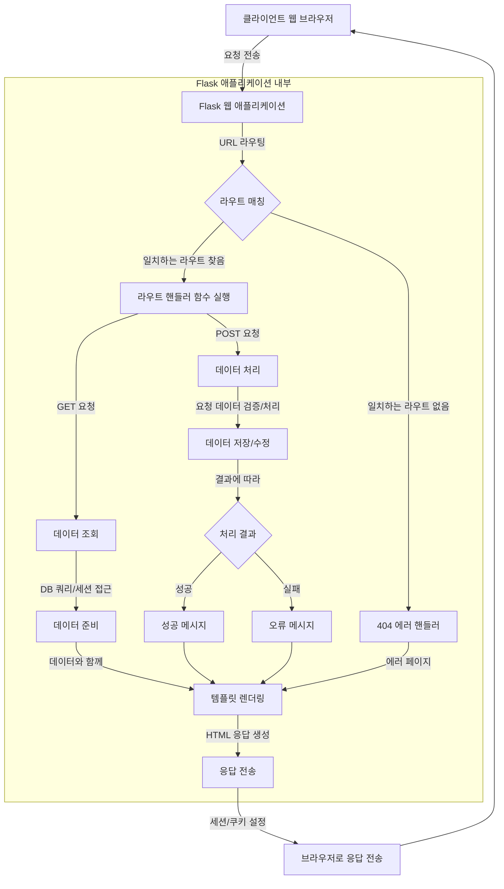

# Flask 웹 요청 처리 튜토리얼

## 목차
- [소개](#소개)
- [초기 설정](#초기-설정)
  - [필요한 라이브러리](#필요한-라이브러리)
  - [디렉토리 구조](#디렉토리-구조)
- [디렉토리 구조 상세 설명](#디렉토리-구조-상세-설명)
- [Flask 웹 요청 처리](#flask-웹-요청-처리)
  - [기본 라우팅](#기본-라우팅)
  - [다양한 HTTP 메소드 처리](#다양한-http-메소드-처리)
  - [URL 변수](#url-변수)
  - [요청 데이터 접근](#요청-데이터-접근)
  - [응답 생성](#응답-생성)
  - [세션 관리](#세션-관리)
  - [플래시 메시지](#플래시-메시지)
  - [에러 핸들링](#에러-핸들링)
- [예제 애플리케이션 구현](#예제-애플리케이션-구현)
  - [app.py](#apppy)
  - [models.py](#modelspy)
  - [templates/layout.html](#templateslayouthtml)
  - [templates/index.html](#templatesindexhtml)
  - [templates/login.html](#templatesloginhtml)
  - [templates/register.html](#templatesregisterhtml)
  - [templates/profile.html](#templatesprofilehtml)
  - [static/style.css](#staticstylecss)
- [요청부터 응답까지의 플로우](#요청부터-응답까지의-플로우)
- [서버 실행 및 클라이언트 요청 방법](#서버-실행-및-클라이언트-요청-방법)
  - [서버 실행](#서버-실행)
  - [클라이언트 요청 방법](#클라이언트-요청-방법)
- [결론](#결론)

## 소개

이 튜토리얼에서는 Flask를 사용하여 웹 요청을 처리하는 방법에 중점을 두고 알아보겠습니다. Flask는 Python으로 작성된 마이크로 웹 프레임워크로, 다양한 웹 요청을 간단하게 처리할 수 있습니다. 사용자 인증 기능이 있는 간단한 웹 애플리케이션을 만들어 보면서 Flask에서 웹 요청 처리의 기본 개념을 배워보겠습니다.

## 초기 설정

### 필요한 라이브러리

시작하기 전에 다음 라이브러리를 설치해야 합니다:

```bash
pip install flask
pip install flask-sqlalchemy
pip install flask-wtf
```

- **Flask**: 웹 애플리케이션 프레임워크
- **Flask-SQLAlchemy**: 데이터베이스 작업을 위한 ORM 확장
- **Flask-WTF**: 웹 폼 처리를 위한 확장

### 디렉토리 구조

프로젝트의 기본 디렉토리 구조는 다음과 같습니다:

```
flask_web_tutorial/
│
├── app.py                  # 애플리케이션의 메인 파일
├── models.py               # 데이터베이스 모델 정의
├── forms.py                # WTForms 폼 클래스 정의
├── instance/               # 인스턴스 폴더 (데이터베이스 파일 등)
│   └── users.db            # SQLite 데이터베이스 파일
├── static/                 # 정적 파일 (CSS, JS, 이미지 등)
│   └── style.css           # 스타일시트
└── templates/              # HTML 템플릿
    ├── layout.html         # 기본 레이아웃 템플릿
    ├── index.html          # 홈페이지
    ├── login.html          # 로그인 페이지
    ├── register.html       # 사용자 등록 페이지
    └── profile.html        # 사용자 프로필 페이지
```

## 디렉토리 구조 상세 설명

1. **app.py**: 
   - Flask 애플리케이션의 진입점(entry point)
   - 라우트 정의, 애플리케이션 설정, 요청 처리 로직 포함
   - 세션 관리, 플래시 메시지, 에러 핸들링 등의 기능 구현

2. **models.py**: 
   - 데이터베이스 모델 클래스 정의
   - 사용자 계정 정보를 저장할 User 모델 정의

3. **forms.py**: 
   - WTForms를 사용한 폼 클래스 정의
   - 사용자 입력 유효성 검증을 위한 로직 포함
   - 로그인 폼, 등록 폼 등 정의

4. **instance/**: 
   - Flask 인스턴스 폴더로, 애플리케이션 실행 중 생성되는 파일 보관
   - 데이터베이스 파일이 저장됨

5. **static/**: 
   - 정적 자원 파일들이 위치하는 폴더
   - CSS, JavaScript, 이미지 등 포함

6. **templates/**: 
   - HTML 템플릿 파일 저장
   - Jinja2 템플릿 엔진을 사용하여 동적 콘텐츠 렌더링
   - 기본 레이아웃과 각 페이지별 템플릿 포함

## Flask 웹 요청 처리

### 기본 라우팅

Flask에서는 `@app.route()` 데코레이터를 사용하여 URL과 함수를 매핑합니다.

```python
@app.route('/')
def index():
    return '홈페이지입니다.'
```

### 다양한 HTTP 메소드 처리

HTTP 메소드를 지정하여 해당 메소드의 요청만 처리할 수 있습니다.

```python
@app.route('/login', methods=['GET', 'POST'])
def login():
    if request.method == 'POST':
        # 로그인 처리 로직
        return '로그인 처리'
    else:
        # GET 요청 - 로그인 폼 표시
        return '로그인 폼'
```

### URL 변수

URL 경로에 변수를 사용하여 동적인 라우팅을 구현할 수 있습니다.

```python
@app.route('/user/<username>')
def show_user_profile(username):
    return f'{username}의 프로필 페이지입니다.'

@app.route('/post/<int:post_id>')
def show_post(post_id):
    return f'포스트 #{post_id}'
```

### 요청 데이터 접근

Flask에서는 `request` 객체를 통해 클라이언트 요청 데이터에 접근할 수 있습니다.

```python
from flask import request

@app.route('/submit', methods=['POST'])
def submit():
    # 폼 데이터
    name = request.form.get('name')
    # JSON 데이터
    data = request.get_json()
    # URL 쿼리 파라미터
    page = request.args.get('page', default=1, type=int)
    # 파일 업로드
    file = request.files.get('upload')
    
    # 요청 헤더
    user_agent = request.headers.get('User-Agent')
    
    # 쿠키
    username = request.cookies.get('username')
```

### 응답 생성

다양한 형태의 응답을 생성할 수 있습니다.

```python
from flask import make_response, redirect, url_for, render_template, jsonify

# HTML 응답
@app.route('/page')
def page():
    return '<h1>HTML 페이지</h1>'

# 템플릿 렌더링
@app.route('/template')
def template():
    return render_template('index.html', title='홈')

# JSON 응답
@app.route('/api/data')
def api_data():
    return jsonify({'name': '홍길동', 'age': 30})

# 리다이렉트
@app.route('/redirect')
def redirect_example():
    return redirect(url_for('index'))

# 사용자 정의 응답
@app.route('/custom')
def custom_response():
    resp = make_response('사용자 정의 응답')
    resp.headers['X-Custom-Header'] = 'Custom Value'
    resp.set_cookie('username', 'flask_user')
    return resp

# 상태 코드
@app.route('/error')
def error():
    return '에러 발생', 500
```

### 세션 관리

Flask에서는 `session` 객체를 통해 사용자 세션을 관리할 수 있습니다.

```python
from flask import session

app.secret_key = 'your_secret_key'  # 세션 암호화를 위한 키

@app.route('/set_session')
def set_session():
    session['username'] = 'flask_user'
    return '세션 설정 완료'

@app.route('/get_session')
def get_session():
    username = session.get('username', 'Guest')
    return f'사용자: {username}'

@app.route('/clear_session')
def clear_session():
    session.clear()
    return '세션 삭제 완료'
```

### 플래시 메시지

`flash` 함수를 사용하여 일회성 메시지를 표시할 수 있습니다.

```python
from flask import flash

@app.route('/message')
def message():
    flash('성공적으로 처리되었습니다.')
    return redirect(url_for('index'))
```

템플릿에서는 다음과 같이 메시지를 표시합니다:

```html

  
    <ul class="flashes">
    
      <li>{{ message }}</li>
    
    </ul>
  

```

### 에러 핸들링

에러 핸들러를 정의하여 에러 페이지를 사용자 정의할 수 있습니다.

```python
@app.errorhandler(404)
def page_not_found(e):
    return render_template('404.html'), 404

@app.errorhandler(500)
def internal_server_error(e):
    return render_template('500.html'), 500
```

## 예제 애플리케이션 구현

이제 위에서 설명한 개념을 활용하여 사용자 인증 기능이 있는 간단한 웹 애플리케이션을 구현해 보겠습니다.

### app.py

```python
from flask import Flask, render_template, request, redirect, url_for, flash, session
from werkzeug.security import generate_password_hash, check_password_hash
from models import db, User
import os

app = Flask(__name__)
app.config['SECRET_KEY'] = 'your_secret_key'
app.config['SQLALCHEMY_DATABASE_URI'] = 'sqlite:///instance/users.db'
app.config['SQLALCHEMY_TRACK_MODIFICATIONS'] = False

# 데이터베이스 초기화
db.init_app(app)

# 애플리케이션 컨텍스트 내에서 데이터베이스 생성
with app.app_context():
    if not os.path.exists('instance'):
        os.makedirs('instance')
    db.create_all()

# 홈 페이지
@app.route('/')
def index():
    return render_template('index.html')

# 사용자 등록
@app.route('/register', methods=['GET', 'POST'])
def register():
    if request.method == 'POST':
        username = request.form.get('username')
        password = request.form.get('password')
        email = request.form.get('email')
        
        # 입력 검증
        if not username or not password or not email:
            flash('모든 필드를 입력해주세요.')
            return redirect(url_for('register'))
        
        # 사용자 중복 확인
        existing_user = User.query.filter_by(username=username).first()
        if existing_user:
            flash('이미 존재하는 사용자명입니다.')
            return redirect(url_for('register'))
        
        # 이메일 중복 확인
        existing_email = User.query.filter_by(email=email).first()
        if existing_email:
            flash('이미 사용 중인 이메일입니다.')
            return redirect(url_for('register'))
        
        # 비밀번호 해싱
        hashed_password = generate_password_hash(password)
        
        # 사용자 생성
        new_user = User(username=username, password=hashed_password, email=email)
        db.session.add(new_user)
        db.session.commit()
        
        flash('성공적으로 등록되었습니다. 로그인해주세요.')
        return redirect(url_for('login'))
    
    return render_template('register.html')

# 로그인
@app.route('/login', methods=['GET', 'POST'])
def login():
    if request.method == 'POST':
        username = request.form.get('username')
        password = request.form.get('password')
        
        if not username or not password:
            flash('사용자명과 비밀번호를 입력해주세요.')
            return redirect(url_for('login'))
        
        user = User.query.filter_by(username=username).first()
        
        if not user or not check_password_hash(user.password, password):
            flash('사용자명 또는 비밀번호가 일치하지 않습니다.')
            return redirect(url_for('login'))
        
        # 세션에 사용자 정보 저장
        session['user_id'] = user.id
        session['username'] = user.username
        
        flash(f'{username}님, 환영합니다!')
        return redirect(url_for('profile'))
    
    return render_template('login.html')

# 로그아웃
@app.route('/logout')
def logout():
    # 세션에서 사용자 정보 제거
    session.pop('user_id', None)
    session.pop('username', None)
    flash('로그아웃되었습니다.')
    return redirect(url_for('index'))

# 사용자 프로필
@app.route('/profile')
def profile():
    # 로그인 상태 확인
    if 'user_id' not in session:
        flash('먼저 로그인해주세요.')
        return redirect(url_for('login'))
    
    user_id = session['user_id']
    user = User.query.get(user_id)
    
    if not user:
        flash('사용자 정보를 찾을 수 없습니다.')
        return redirect(url_for('logout'))
    
    return render_template('profile.html', user=user)

# 404 에러 핸들러
@app.errorhandler(404)
def page_not_found(e):
    return render_template('404.html'), 404

if __name__ == '__main__':
    app.run(debug=True)
```

### models.py

```python
from flask_sqlalchemy import SQLAlchemy
from datetime import datetime

db = SQLAlchemy()

class User(db.Model):
    id = db.Column(db.Integer, primary_key=True)
    username = db.Column(db.String(80), unique=True, nullable=False)
    email = db.Column(db.String(120), unique=True, nullable=False)
    password = db.Column(db.String(200), nullable=False)
    created_at = db.Column(db.DateTime, default=datetime.utcnow)
    
    def __repr__(self):
        return f'<User {self.username}>'
```

### templates/layout.html

```html
<!DOCTYPE html>
<html lang="ko">
<head>
  <meta charset="UTF-8">
  <meta name="viewport" content="width=device-width, initial-scale=1.0">
  <title>Flask 웹 요청 처리 예제</title>
  <link rel="stylesheet" href="{{ url_for('static', filename='style.css') }}">
</head>
<body>
  <header>
    <h1>Flask 웹 애플리케이션</h1>
    <nav>
      <ul>
        <li><a href="{{ url_for('index') }}">홈</a></li>
        
          <li><a href="{{ url_for('profile') }}">프로필</a></li>
          <li><a href="{{ url_for('logout') }}">로그아웃 ({{ session.username }})</a></li>
        
          <li><a href="{{ url_for('login') }}">로그인</a></li>
          <li><a href="{{ url_for('register') }}">회원가입</a></li>
        
      </ul>
    </nav>
  </header>
  
  <main>
    <!-- 플래시 메시지 표시 -->
    
      
        <div class="flashes">
          
            <div class="flash-message">{{ message }}</div>
          
        </div>
      
    
    
    
  </main>
  
  <footer>
    <p>&copy; 2025 Flask 웹 요청 처리 튜토리얼</p>
  </footer>
</body>
</html>
```

### templates/index.html

```html


홈 - Flask 웹 요청 처리 예제


  <section class="welcome">
    <h2>Flask 웹 요청 처리 예제에 오신 것을 환영합니다!</h2>
    <p>이 애플리케이션은 Flask를 사용하여 다양한 웹 요청을 처리하는 방법을 보여줍니다.</p>
    
    
      <p>안녕하세요, {{ session.username }}님! <a href="{{ url_for('profile') }}">프로필</a>을 확인하세요.</p>
    
      <p>기능을 사용하려면 <a href="{{ url_for('login') }}">로그인</a>하거나 <a href="{{ url_for('register') }}">회원가입</a>하세요.</p>
    
  </section>
  
  <section class="features">
    <h3>이 예제에서 볼 수 있는 기능들:</h3>
    <ul>
      <li>사용자 등록 및 로그인 (세션 관리)</li>
      <li>플래시 메시지</li>
      <li>URL 라우팅</li>
      <li>폼 데이터 처리</li>
      <li>템플릿 렌더링</li>
      <li>에러 핸들링</li>
    </ul>
  </section>

```

### templates/login.html

```html


로그인 - Flask 웹 요청 처리 예제


  <section class="auth-form">
    <h2>로그인</h2>
    <form method="POST" action="{{ url_for('login') }}">
      <div class="form-group">
        <label for="username">사용자명:</label>
        <input type="text" id="username" name="username" required>
      </div>
      <div class="form-group">
        <label for="password">비밀번호:</label>
        <input type="password" id="password" name="password" required>
      </div>
      <div class="form-group">
        <button type="submit">로그인</button>
      </div>
    </form>
    <p>계정이 없으신가요? <a href="{{ url_for('register') }}">회원가입</a>하세요.</p>
  </section>

```

### templates/register.html

```html


회원가입 - Flask 웹 요청 처리 예제


  <section class="auth-form">
    <h2>회원가입</h2>
    <form method="POST" action="{{ url_for('register') }}">
      <div class="form-group">
        <label for="username">사용자명:</label>
        <input type="text" id="username" name="username" required>
      </div>
      <div class="form-group">
        <label for="email">이메일:</label>
        <input type="email" id="email" name="email" required>
      </div>
      <div class="form-group">
        <label for="password">비밀번호:</label>
        <input type="password" id="password" name="password" required>
      </div>
      <div class="form-group">
        <button type="submit">회원가입</button>
      </div>
    </form>
    <p>이미 계정이 있으신가요? <a href="{{ url_for('login') }}">로그인</a>하세요.</p>
  </section>

```

### templates/profile.html

```html


프로필 - Flask 웹 요청 처리 예제


  <section class="profile">
    <h2>{{ user.username }}님의 프로필</h2>
    <div class="profile-info">
      <p><strong>사용자명:</strong> {{ user.username }}</p>
      <p><strong>이메일:</strong> {{ user.email }}</p>
      <p><strong>가입일:</strong> {{ user.created_at.strftime('%Y-%m-%d %H:%M:%S') }}</p>
    </div>
  </section>

```

### static/style.css

```css
/* 기본 스타일 */
* {
  box-sizing: border-box;
  margin: 0;
  padding: 0;
}

body {
  font-family: Arial, sans-serif;
  line-height: 1.6;
  color: #333;
  background-color: #f5f5f5;
}

header {
  background-color: #2c3e50;
  color: white;
  padding: 1rem;
}

header h1 {
  margin-bottom: 0.5rem;
}

nav ul {
  list-style: none;
  display: flex;
}

nav ul li {
  margin-right: 1rem;
}

nav ul li a {
  color: white;
  text-decoration: none;
}

nav ul li a:hover {
  text-decoration: underline;
}

main {
  max-width: 800px;
  margin: 20px auto;
  padding: 20px;
  background-color: white;
  border-radius: 5px;
  box-shadow: 0 0 10px rgba(0, 0, 0, 0.1);
}

footer {
  text-align: center;
  padding: 1rem;
  background-color: #2c3e50;
  color: white;
  font-size: 0.8rem;
}

/* 플래시 메시지 */
.flashes {
  margin-bottom: 1rem;
}

.flash-message {
  padding: 0.5rem;
  background-color: #3498db;
  color: white;
  border-radius: 3px;
  margin-bottom: 0.5rem;
}

/* 환영 섹션 */
.welcome {
  margin-bottom: 2rem;
}

/* 기능 목록 */
.features {
  background-color: #f9f9f9;
  padding: 1rem;
  border-radius: 5px;
}

.features ul {
  margin-left: 1.5rem;
}

/* 인증 폼 */
.auth-form {
  max-width: 400px;
  margin: 0 auto;
}

.form-group {
  margin-bottom: 1rem;
}

.form-group label {
  display: block;
  margin-bottom: 0.3rem;
}

.form-group input {
  width: 100%;
  padding: 0.5rem;
  border: 1px solid #ddd;
  border-radius: 3px;
}

button {
  background-color: #3498db;
  color: white;
  border: none;
  padding: 0.6rem 1rem;
  border-radius: 3px;
  cursor: pointer;
}

button:hover {
  background-color: #2980b9;
}

/* 프로필 페이지 */
.profile {
  background-color: #f9f9f9;
  padding: 1rem;
  border-radius: 5px;
}

.profile-info {
  margin-top: 1rem;
}

.profile-info p {
  margin-bottom: 0.5rem;
}
```

## 요청부터 응답까지의 플로우



## 서버 실행 및 클라이언트 요청 방법

### 서버 실행

1. 프로젝트 폴더로 이동합니다:
```bash
cd flask_web_tutorial
```

2. Flask 애플리케이션 실행:
```bash
python app.py
```

서버가 성공적으로 시작되면 다음과 같은 메시지가 표시됩니다:
```
 * Running on http://127.0.0.1:5000/ (Press CTRL+C to quit)
 * Restarting with stat
 * Debugger is active!
 * Debugger PIN: XXX-XXX-XXX
```

### 클라이언트 요청 방법

1. **웹 브라우저 접근**
   - 웹 브라우저를 열고 `http://127.0.0.1:5000/` 주소로 이동합니다.
   - 이제 웹 인터페이스를 통해 애플리케이션의 다양한 기능을 사용할 수 있습니다.

2. **회원가입**
   - 홈페이지에서 '회원가입' 링크를 클릭합니다.
   - 사용자명, 이메일, 비밀번호를 입력하고 '회원가입' 버튼을 클릭합니다.
   - 성공적으로 등록되면 로그인 페이지로 리다이렉트되고 성공 메시지가 표시됩니다.

3. **로그인**
   - 로그인 페이지에서 사용자명과 비밀번호를 입력합니다.
   - '로그인' 버튼을 클릭하면 인증이 진행됩니다.
   - 인증이 성공하면 세션에 사용자 정보가 저장되고 프로필 페이지로 리다이렉트됩니다.

4. **프로필 확인**
   - 로그인 후 프로필 페이지에서 사용자 정보를 확인할 수 있습니다.
   - 상단 네비게이션 바에 사용자명이 표시되며, 이를 통해 로그인 상태를 확인할 수 있습니다.

5. **로그아웃**
   - 상단 네비게이션 바에서 '로그아웃' 링크를 클릭하면 세션에서 사용자 정보가 제거됩니다.
   - 로그아웃 후 홈페이지로 리다이렉트되고 로그아웃 메시지가 표시됩니다.

6. **웹 요청 디버깅**
   - Flask 개발 서버의 디버그 모드가 활성화되어 있어 웹 요청 처리 중 발생하는 오류를 확인할 수 있습니다.
   - 브라우저에서 오류가 발생하면 상세한 오류 정보와 스택 트레이스가 표시됩니다.
   - 터미널에서도 요청 로그를 확인할 수 있습니다.

## 결론

이 튜토리얼에서는 Flask를 사용하여 다양한 웹 요청을 처리하는 방법을 알아보았습니다. 우리는 다음과 같은 내용을 다루었습니다:

1. **기본 라우팅** - URL과 함수를 매핑하는 방법
2. **HTTP 메소드 처리** - GET, POST 등 다양한 메소드 요청 처리
3. **요청 데이터 접근** - 폼 데이터, URL 파라미터, 쿼리 문자열 등에 접근하는 방법
4. **응답 생성** - HTML, 리다이렉트, JSON 등 다양한 응답 생성 방법
5. **세션 관리** - 사용자 세션을 통한 상태 관리
6. **플래시 메시지** - 일회성 알림 메시지 표시
7. **에러 핸들링** - 사용자 친화적인 오류 페이지 제공

이러한 기본적인 웹 요청 처리 기술을 숙지하면 더 복잡한 Flask 애플리케이션을 개발할 수 있는 토대가 마련됩니다. 다음과 같은 발전된 주제로 학습을 이어나갈 수 있습니다:

- **블루프린트(Blueprint)를 사용한 모듈화**
- **REST API 개발**
- **사용자 인증 시스템 확장**
- **파일 업로드 처리**
- **AJAX 요청 처리**
- **웹소켓을 활용한 실시간 통신**

Flask는 마이크로 프레임워크이기 때문에 필요에 따라 확장할 수 있으며, 이를 통해 다양한 규모와 복잡성의 웹 애플리케이션을 구축할 수 있습니다.